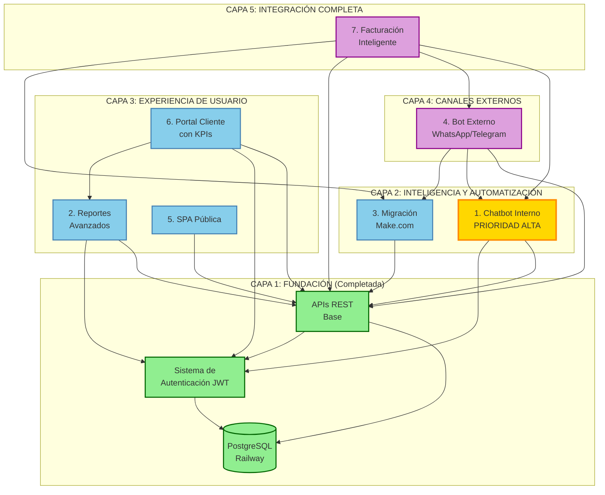

# HAGO PRODUCE - FASE 2: ROADMAP Y PROMPTS DE IMPLEMENTACIÓN

**Fecha de Análisis:** 22 de Febrero, 2026  
**Repositorio:** https://github.com/nhadadn/Hago-Produce  
**Estado Actual:** Fase 0 completada, Fase 1A-1C en progreso

---

## 📊 RESUMEN EJECUTIVO

### Estado Actual del Proyecto

**HAGO PRODUCE** es un sistema empresarial de facturación y gestión de materias primas construido con:

- **Stack Principal:** Next.js 14 (App Router), TypeScript, TailwindCSS, shadcn/ui
- **Backend:** Next.js API Routes (monorepo), Prisma ORM
- **Base de Datos:** PostgreSQL (Railway Managed)
- **Autenticación:** JWT personalizado con bcrypt
- **Infraestructura:** Railway (App + DB), Docker, GitHub Actions CI/CD
- **Testing:** Jest (unitarios), Playwright (E2E)

### Componentes Implementados (Fase 0 y 1A-1C)

✅ **Infraestructura base:**
- Repositorio configurado con CI/CD completo
- PostgreSQL con 9 modelos de datos (User, Customer, Supplier, Product, ProductPrice, Invoice, InvoiceItem, InvoiceNote, AuditLog)
- Sistema de autenticación JWT con 4 roles (ADMIN, ACCOUNTING, MANAGEMENT, CUSTOMER)
- Middleware de autorización por rutas

✅ **APIs REST implementadas:**
- `/api/v1/auth/*` - Login, registro, refresh token, me
- `/api/v1/users/*` - CRUD de usuarios
- `/api/v1/customers/*` - CRUD de clientes
- `/api/v1/suppliers/*` - CRUD de proveedores
- `/api/v1/products/*` - CRUD de productos
- `/api/v1/product-prices/*` - CRUD de precios con bulk update
- `/api/v1/invoices/*` - CRUD de facturas con notas y cambio de estado
- `/api/webhooks/make/prices` - Webhook para actualización de precios desde Make.com

✅ **Componentes UI:**
- Sistema de autenticación (Login/Register)
- Dashboard administrativo con KPIs
- Gestión de productos, proveedores, clientes
- Sistema de facturación completo (crear, editar, listar, detalle)
- Filtros dinámicos y paginación
- Generación de PDF para facturas

### Componentes Pendientes (Fase 2)

Los siguientes 7 componentes requieren implementación completa:

1. **Agente conversacional (Chatbot interno)** - PRIORIDAD ALTA
2. **Sistema de reportes avanzados**
3. **Migración de integraciones a Make.com**
4. **Bot externo multicanal (WhatsApp/Telegram)**
5. **SPA pública para clientes**
6. **Portal de cliente con dashboard y KPIs**
7. **Sistema de facturación inteligente con bot**

---

## 🎯 SECCIÓN 1: ANÁLISIS DE ARQUITECTURA ACTUAL

### 1.1 Arquitectura Técnica

**Patrón arquitectónico:** Monolito modular con separación de capas

```
┌─────────────────────────────────────────────────────────────┐
│                    FRONTEND (Next.js 14)                     │
│  ┌──────────────┐  ┌──────────────┐  ┌──────────────┐      │
│  │ Admin Portal │  │ Accounting   │  │ Customer     │      │
│  │ (Dashboard)  │  │ Portal       │  │ Portal       │      │
│  └──────────────┘  └──────────────┘  └──────────────┘      │
└─────────────────────────────────────────────────────────────┘
                            ↕ HTTP/REST
┌─────────────────────────────────────────────────────────────┐
│              BACKEND (Next.js API Routes)                    │
│  ┌──────────────────────────────────────────────────────┐   │
│  │  Controllers (Route Handlers)                        │   │
│  │  /api/v1/{auth,users,products,invoices,...}          │   │
│  └──────────────────────────────────────────────────────┘   │
│  ┌──────────────────────────────────────────────────────┐   │
│  │  Services Layer                                      │   │
│  │  - users.service.ts                                  │   │
│  │  - invoices.service.ts                               │   │
│  │  - products.service.ts                               │   │
│  │  - customers.service.ts                              │   │
│  │  - suppliers.service.ts                              │   │
│  │  - product-prices.service.ts                         │   │
│  └──────────────────────────────────────────────────────┘   │
│  ┌──────────────────────────────────────────────────────┐   │
│  │  Data Access Layer (Prisma ORM)                      │   │
│  └──────────────────────────────────────────────────────┘   │
└─────────────────────────────────────────────────────────────┘
                            ↕ SQL
┌─────────────────────────────────────────────────────────────┐
│              PostgreSQL (Railway)                            │
│  9 tablas: users, customers, suppliers, products,           │
│  product_prices, invoices, invoice_items,                   │
│  invoice_notes, audit_log                                   │
└─────────────────────────────────────────────────────────────┘
```

### 1.2 Fortalezas Identificadas

1. **Separación de responsabilidades clara:** Controllers → Services → Data Access
2. **Testing robusto:** 13 archivos de test (unitarios + integración)
3. **Seguridad implementada:** JWT, bcrypt, middleware de autorización, audit log
4. **CI/CD funcional:** GitHub Actions con lint, test, CodeQL, deploy preview
5. **Documentación exhaustiva:** ADRs, wireframes, onboarding guides
6. **Infraestructura escalable:** Railway con health checks, Docker para desarrollo local

### 1.3 Gaps Técnicos para Fase 2

1. **No hay integración con LLM/IA:** OpenAI API Key en .env pero sin implementación
2. **Webhooks limitados:** Solo `/webhooks/make/prices`, falta infraestructura genérica
3. **Sin sistema de notificaciones:** No hay integración con email/SMS/WhatsApp/Telegram
4. **Sin reportes avanzados:** Dashboard básico sin drill-down, exportación limitada
5. **Portal de cliente básico:** Falta dashboard con KPIs, estado de cuenta detallado
6. **Sin bot externo:** No hay integración con WhatsApp Business API o Telegram Bot API
7. **Sin SPA pública:** Toda la aplicación requiere autenticación

---

## 🔗 SECCIÓN 2: ANÁLISIS DE DEPENDENCIAS ENTRE COMPONENTES

### 2.1 Diagrama de Dependencias Técnicas



### 2.2 Matriz de Dependencias

| Componente | Depende de | Bloquea a | Complejidad | Prioridad |
|------------|------------|-----------|-------------|-----------|
| **1. Chatbot Interno** | API REST, Auth JWT | Facturación Inteligente, Bot Externo | Alta | 🔴 CRÍTICA |
| **2. Reportes Avanzados** | API REST, Auth JWT | Portal Cliente KPIs | Media | 🟡 Alta |
| **3. Migración Make.com** | API REST | Bot Externo, Facturación Inteligente | Media | 🟡 Alta |
| **4. Bot Externo** | Chatbot, Make.com, API REST | Facturación Inteligente | Alta | 🟢 Media |
| **5. SPA Pública** | API REST | - | Baja | 🟢 Media |
| **6. Portal Cliente KPIs** | API REST, Reportes Avanzados | - | Media | 🟡 Alta |
| **7. Facturación Inteligente** | Chatbot, Bot Externo, Make.com | - | Muy Alta | 🔴 CRÍTICA |

### 2.3 Dependencias Críticas y Bloqueantes

#### 🚨 Bloqueante Crítico #1: Chatbot Interno
**Impacto:** Bloquea 2 componentes (Bot Externo, Facturación Inteligente)  
**Razón:** El chatbot es el motor de inteligencia que debe ser reutilizado en:
- Bot externo (WhatsApp/Telegram) para consultas de clientes
- Sistema de facturación inteligente para creación conversacional de facturas

**Estrategia de mitigación:**
- Diseñar el chatbot con arquitectura modular y API interna reutilizable
- Separar la lógica de procesamiento de lenguaje natural (NLP) de la interfaz UI
- Crear un servicio `ChatService` que pueda ser consumido por múltiples canales

#### 🚨 Bloqueante Crítico #2: Migración Make.com
**Impacto:** Bloquea Bot Externo y Facturación Inteligente  
**Razón:** Make.com será el orquestador de:
- Notificaciones multicanal (WhatsApp, Telegram, Email)
- Sincronización con QuickBooks (durante transición)
- Webhooks de eventos de facturación

**Estrategia de mitigación:**
- Implementar webhooks genéricos (`/api/webhooks/make/[event]`)
- Documentar contratos de API para Make.com
- Crear escenarios de Make.com en paralelo al desarrollo

#### ⚠️ Bloqueante Moderado: Reportes Avanzados
**Impacto:** Bloquea Portal Cliente con KPIs  
**Razón:** El portal de cliente reutilizará componentes de reportes (gráficos, exportación)

**Estrategia de mitigación:**
- Desarrollar componentes de reportes como biblioteca reutilizable
- Usar Recharts (ya instalado) para gráficos consistentes
- Crear hooks personalizados para lógica de filtrado y drill-down

---

## 📅 SECCIÓN 3: ROADMAP DE IMPLEMENTACIÓN RECOMENDADO

### 3.1 Orden de Implementación Justificado

#### **SPRINT 1 (Semanas 1-2): Fundación de Inteligencia**
**Componentes:** Chatbot Interno (Componente #1)

**Justificación técnica:**
- Es el componente con mayor número de dependientes (2 componentes bloqueados)
- Requiere definir arquitectura de IA que será reutilizada en toda la Fase 2
- Permite validar integración con OpenAI API antes de escalar a canales externos
- Desbloquea el desarrollo paralelo de Bot Externo y Facturación Inteligente

**Entregables:**
- Servicio `ChatService` con function calling a APIs internas
- UI de chat integrada en todas las pantallas administrativas
- Intents implementados: `price_lookup`, `best_supplier`, `invoice_status`, `customer_balance`, `product_info`
- Tests unitarios y de integración para cada intent
- Documentación de API interna del chatbot

---

#### **SPRINT 2 (Semanas 3-4): Automatización y Datos**
**Componentes:** Migración Make.com (Componente #3) + Reportes Avanzados (Componente #2)

**Justificación técnica:**
- Make.com desbloquea Bot Externo (Sprint 3)
- Reportes Avanzados desbloquea Portal Cliente (Sprint 3)
- Ambos componentes son independientes entre sí, permitiendo desarrollo paralelo
- Reportes requiere análisis de datos que puede informar diseño de notificaciones en Make.com

**Entregables Make.com:**
- Webhooks genéricos: `/api/webhooks/make/invoice-created`, `/api/webhooks/make/invoice-status-changed`
- Escenarios de Make.com: notificaciones por email, sincronización con QuickBooks
- Sistema de eventos interno (`EventEmitter` o similar) para disparar webhooks
- Documentación de contratos de webhooks

**Entregables Reportes:**
- Dashboard con KPIs: ingresos mensuales, facturas pendientes, top clientes, top productos
- Filtros dinámicos: rango de fechas, cliente, estado, producto
- Drill-down: clic en gráfico para ver detalle de facturas
- Exportación a PDF y CSV
- Componentes reutilizables: `<KPICard>`, `<FilterBar>`, `<ExportButton>`, `<DrillDownTable>`

---

#### **SPRINT 3 (Semanas 5-6): Experiencia de Usuario**
**Componentes:** SPA Pública (Componente #5) + Portal Cliente KPIs (Componente #6)

**Justificación técnica:**
- SPA Pública es independiente y de baja complejidad (desarrollo rápido)
- Portal Cliente reutiliza componentes de Reportes Avanzados (Sprint 2)
- Ambos mejoran la experiencia de clientes externos sin bloquear componentes críticos
- Permite validar autenticación de clientes antes de integrar Bot Externo

**Entregables SPA Pública:**
- Landing page con información de la empresa
- Página de contacto
- Página de servicios
- Formulario de registro de clientes (sin autenticación)
- Diseño responsive con TailwindCSS

**Entregables Portal Cliente:**
- Dashboard con KPIs personalizados: balance pendiente, facturas del mes, historial de pagos
- Gráficos de consumo por producto (reutilizando Recharts)
- Timeline de facturas con estados
- Descarga masiva de facturas (ZIP)
- Notificaciones in-app (toast) para cambios de estado

---

#### **SPRINT 4 (Semanas 7-8): Canales Externos**
**Componentes:** Bot Externo Multicanal (Componente #4)

**Justificación técnica:**
- Requiere Chatbot Interno (Sprint 1) y Make.com (Sprint 2) completados
- Integración con APIs externas (WhatsApp Business, Telegram) requiere tiempo de validación
- Permite probar la arquitectura de chatbot en canales externos antes de Facturación Inteligente

**Entregables:**
- Integración con WhatsApp Business API (Meta Cloud API)
- Integración con Telegram Bot API
- Adaptador de canal (`ChannelAdapter`) para reutilizar `ChatService`
- Comandos: `/precio [producto]`, `/factura [número]`, `/balance`
- Notificaciones push: cambio de estado de factura, recordatorio de pago
- Webhook receiver: `/api/webhooks/whatsapp`, `/api/webhooks/telegram`
- Tests de integración con mocks de APIs externas

---

#### **SPRINT 5 (Semanas 9-10): Integración Completa**
**Componentes:** Sistema de Facturación Inteligente (Componente #7)

**Justificación técnica:**
- Requiere todos los componentes anteriores completados
- Es el componente más complejo (integra chatbot, bot externo, Make.com)
- Representa el valor máximo para el usuario final (creación de facturas conversacional)

**Entregables:**
- Flujo conversacional para crear facturas desde el chatbot interno
- Flujo conversacional para crear facturas desde WhatsApp/Telegram
- Validación inteligente de datos (cliente existe, producto existe, precio actual)
- Confirmación antes de crear factura
- Notificación automática al cliente vía Make.com
- Integración con sistema de audit log
- Tests E2E del flujo completo

---

### 3.2 Estimación de Esfuerzo y Complejidad

| Sprint | Componente | Complejidad | Esfuerzo (días) | Riesgo | Dependencias Críticas |
|--------|------------|-------------|-----------------|--------|----------------------|
| 1 | Chatbot Interno | 🔴 Alta | 10-12 | Medio | OpenAI API, Function Calling |
| 2A | Migración Make.com | 🟡 Media | 6-8 | Bajo | Webhooks genéricos |
| 2B | Reportes Avanzados | 🟡 Media | 6-8 | Bajo | Recharts, Exportación PDF |
| 3A | SPA Pública | 🟢 Baja | 4-5 | Muy Bajo | Ninguna |
| 3B | Portal Cliente KPIs | 🟡 Media | 6-7 | Bajo | Reportes Avanzados |
| 4 | Bot Externo | 🔴 Alta | 10-12 | Alto | WhatsApp/Telegram APIs |
| 5 | Facturación Inteligente | 🔴 Muy Alta | 12-15 | Alto | Todos los anteriores |

**Total estimado:** 54-67 días de desarrollo (10-13 semanas con 1 desarrollador)

### 3.3 Riesgos Potenciales y Estrategias de Mitigación

#### Riesgo #1: Latencia de OpenAI API
**Probabilidad:** Alta | **Impacto:** Medio  
**Componentes afectados:** Chatbot Interno, Bot Externo, Facturación Inteligente

**Estrategias de mitigación:**
1. Implementar caché de respuestas frecuentes (Redis o in-memory)
2. Usar streaming de respuestas (`stream: true` en OpenAI API)
3. Mostrar indicadores de carga ("El asistente está pensando...")
4. Timeout de 10 segundos con mensaje de error amigable
5. Fallback a respuestas predefinidas para consultas simples

#### Riesgo #2: Límites de Rate Limiting en APIs Externas
**Probabilidad:** Media | **Impacto:** Alto  
**Componentes afectados:** Bot Externo, Make.com

**Estrategias de mitigación:**
1. Implementar cola de mensajes (Bull/BullMQ con Redis)
2. Rate limiting interno (max 10 mensajes/minuto por usuario)
3. Retry con exponential backoff
4. Monitoreo de cuotas con alertas (Make.com operations, WhatsApp messages)
5. Plan de escalamiento (upgrade a tier superior si es necesario)

#### Riesgo #3: Complejidad de Function Calling
**Probabilidad:** Media | **Impacto:** Medio  
**Componentes afectados:** Chatbot Interno, Facturación Inteligente

**Estrategias de mitigación:**
1. Empezar con 3-5 funciones simples, escalar gradualmente
2. Validación estricta de parámetros con Zod
3. Tests exhaustivos de cada función con múltiples casos de uso
4. Documentación clara de cada función para el LLM
5. Logs detallados de llamadas a funciones para debugging

#### Riesgo #4: Seguridad en Webhooks Públicos
**Probabilidad:** Alta | **Impacto:** Crítico  
**Componentes afectados:** Make.com, Bot Externo

**Estrategias de mitigación:**
1. Autenticación por API Key en headers (`x-api-key`)
2. Validación de firma HMAC para webhooks de WhatsApp/Telegram
3. Rate limiting por IP (max 100 requests/minuto)
4. Validación de payload con Zod antes de procesar
5. Logs de audit para todos los webhooks recibidos
6. Whitelist de IPs de Make.com si es posible

#### Riesgo #5: Experiencia de Usuario en Conversaciones
**Probabilidad:** Media | **Impacto:** Medio  
**Componentes afectados:** Chatbot Interno, Bot Externo, Facturación Inteligente

**Estrategias de mitigación:**
1. Diseñar flujos conversacionales con máximo 3-4 turnos
2. Proveer botones de acción rápida (Quick Replies)
3. Permitir cancelación en cualquier momento (`/cancelar`)
4. Confirmación explícita antes de acciones destructivas
5. Mensajes de error claros con sugerencias de corrección
6. Testing con usuarios reales (beta testing con 3-5 usuarios internos)

#### Riesgo #6: Migración de Datos de QuickBooks
**Probabilidad:** Baja | **Impacto:** Alto  
**Componentes afectados:** Migración Make.com

**Estrategias de mitigación:**
1. Mantener sincronización bidireccional durante 2 meses (período de transición)
2. Script de migración de datos históricos con validación
3. Comparación de totales (QuickBooks vs HAGO PRODUCE) antes de corte final
4. Backup completo de QuickBooks antes de migración
5. Plan de rollback documentado
6. Capacitación del equipo en ambos sistemas durante transición

---

## 📝 SECCIÓN 4: PROMPTS PROFESIONALES PARA IMPLEMENTACIÓN

### Componente #1: Chatbot Interno (Asistente Inteligente)

**Contexto:**
El proyecto HAGO PRODUCE es un sistema de facturación empresarial construido con Next.js 14 (App Router), TypeScript, Prisma ORM y PostgreSQL. Actualmente tiene implementadas APIs REST para gestión de usuarios, clientes, proveedores, productos, precios y facturas. El sistema usa autenticación JWT con 4 roles (ADMIN, ACCOUNTING, MANAGEMENT, CUSTOMER). La base de datos tiene 9 tablas relacionales. El objetivo es implementar un asistente conversacional inteligente que permita a usuarios internos consultar información de negocio mediante lenguaje natural, reduciendo el tiempo de búsqueda de información de minutos a segundos.

**Tarea Específica:**
Implementa un sistema de chatbot interno completo con las siguientes características:

1. **Backend Service (`src/lib/services/chat/chat.service.ts`):**
   - Integración con OpenAI API (GPT-4o-mini) usando function calling
   - Implementar 5 funciones (tools) para consultas a la base de datos:
     - `price_lookup`: Buscar precio actual de un producto por nombre/SKU
     - `best_supplier`: Encontrar el proveedor con mejor precio para un producto
     - `invoice_status`: Consultar estado de una factura por número
     - `customer_balance`: Obtener balance pendiente de un cliente
     - `product_info`: Obtener información detallada de un producto
   - Sistema de contexto conversacional (mantener historial de últimos 5 mensajes)
   - Validación de parámetros con Zod para cada función
   - Manejo de errores con mensajes amigables en español e inglés
   - Logs estructurados de todas las interacciones (usuario, query, función llamada, resultado)

2. **API Route (`src/app/api/v1/chat/route.ts`):**
   - Endpoint POST `/api/v1/chat` que recibe `{ message: string, conversationId?: string }`
   - Autenticación JWT requerida (solo usuarios internos: ADMIN, ACCOUNTING, MANAGEMENT)
   - Streaming de respuestas usando Server-Sent Events (SSE) para mejor UX
   - Rate limiting: máximo 20 mensajes por minuto por usuario
   - Timeout de 15 segundos con mensaje de error

3. **Componente UI (`src/components/chat/ChatWidget.tsx`):**
   - Widget flotante accesible desde todas las pantallas administrativas (botón en esquina inferior derecha)
   - Interfaz de chat con:
     - Input de texto con autocompletado de comandos comunes
     - Área de mensajes con scroll automático
     - Indicador de "escribiendo..." durante procesamiento
     - Formato de respuestas con markdown (tablas, listas, negritas)
     - Botones de acción rápida: "Ver precios", "Buscar factura", "Estado de cliente"
   - Persistencia de conversación en localStorage (máximo 50 mensajes)
   - Modo expandido/colapsado con animaciones suaves

4. **Tipos TypeScript (`src/types/chat.types.ts`):**
   - Definir interfaces para `ChatMessage`, `ChatFunction`, `ChatResponse`, `ConversationContext`

5. **Tests:**
   - Tests unitarios para cada función del chatbot (`src/tests/unit/chat.service.test.ts`)
   - Tests de integración del endpoint API (`src/tests/integration/chat-api.test.ts`)
   - Mocks de OpenAI API para tests determinísticos

**Constraints Técnicos:**
- Usar OpenAI SDK oficial (`openai` npm package, ya instalado)
- Implementar caché de respuestas frecuentes con TTL de 5 minutos (usar Map en memoria o Redis si disponible)
- Máximo 3 llamadas a funciones por conversación (evitar loops infinitos)
- Respuestas del LLM deben ser menores a 500 tokens (configurar `max_tokens`)
- Seguir patrón de servicios existente (ver `src/lib/services/invoices.service.ts` como referencia)
- Usar Prisma Client existente (`src/lib/db.ts`) para consultas a BD
- Implementar audit log para todas las consultas del chatbot
- Seguridad: sanitizar inputs del usuario antes de enviar a OpenAI
- Performance: las consultas a BD deben ejecutarse en menos de 500ms
- Testing obligatorio: cobertura mínima del 80% en servicios

**Output Esperado:**
- `src/lib/services/chat/chat.service.ts` (300-400 líneas)
- `src/lib/services/chat/functions/` (5 archivos, uno por función, 50-80 líneas cada uno)
- `src/app/api/v1/chat/route.ts` (150-200 líneas)
- `src/components/chat/ChatWidget.tsx` (250-300 líneas)
- `src/components/chat/ChatMessage.tsx` (80-100 líneas)
- `src/types/chat.types.ts` (50-70 líneas)
- `src/tests/unit/chat.service.test.ts` (200-250 líneas)
- `src/tests/integration/chat-api.test.ts` (150-200 líneas)
- `docs/chat/README.md` (documentación de uso y arquitectura)
- `docs/chat/function-calling-guide.md` (guía para agregar nuevas funciones)

**Criterios de Aceptación:**
- [ ] Usuario ADMIN puede abrir el chat desde cualquier pantalla administrativa
- [ ] Consulta "¿Cuál es el precio de las manzanas?" retorna precio actual con proveedor
- [ ] Consulta "¿Quién tiene el mejor precio para naranjas?" retorna proveedor con precio más bajo
- [ ] Consulta "¿Cuál es el estado de la factura INV-001?" retorna estado actual y fecha
- [ ] Consulta "¿Cuánto debe el cliente ABC Corp?" retorna balance pendiente con detalle
- [ ] Respuestas se muestran con formato markdown (tablas para múltiples resultados)
- [ ] Indicador de "escribiendo..." se muestra durante procesamiento
- [ ] Conversación persiste al recargar la página (localStorage)
- [ ] Rate limiting bloquea más de 20 mensajes/minuto con mensaje de error
- [ ] Tests unitarios pasan con cobertura > 80%
- [ ] Tests de integración validan flujo completo con mocks de OpenAI
- [ ] Logs estructurados se guardan en audit_log para cada consulta
- [ ] Tiempo de respuesta promedio < 3 segundos (medido con 10 consultas)
- [ ] Manejo de errores: si OpenAI falla, muestra mensaje amigable sin exponer detalles técnicos

**Snippet de Ejemplo:**

```typescript
// src/lib/services/chat/chat.service.ts
import OpenAI from 'openai';
import { prisma } from '@/lib/db';
import { priceLookupFunction } from './functions/price-lookup';
import { bestSupplierFunction } from './functions/best-supplier';

const openai = new OpenAI({
  apiKey: process.env.OPENAI_API_KEY,
});

interface ChatMessage {
  role: 'user' | 'assistant' | 'system';
  content: string;
}

interface ChatContext {
  conversationId: string;
  messages: ChatMessage[];
  userId: string;
}

export class ChatService {
  private static conversationCache = new Map<string, ChatContext>();

  static async processMessage(
    userId: string,
    message: string,
    conversationId?: string
  ): Promise<{ response: string; conversationId: string }> {
    // 1. Obtener o crear contexto de conversación
    const context = this.getOrCreateContext(userId, conversationId);
    
    // 2. Agregar mensaje del usuario
    context.messages.push({ role: 'user', content: message });

    // 3. Llamar a OpenAI con function calling
    const completion = await openai.chat.completions.create({
      model: 'gpt-4o-mini',
      messages: [
        {
          role: 'system',
          content: 'Eres un asistente de HAGO PRODUCE. Ayudas a usuarios internos a consultar información de productos, precios, facturas y clientes. Responde en español de forma concisa y profesional.',
        },
        ...context.messages,
      ],
      tools: [
        priceLookupFunction.definition,
        bestSupplierFunction.definition,
        // ... otras funciones
      ],
      max_tokens: 500,
      temperature: 0.3,
    });

    const assistantMessage = completion.choices[0].message;

    // 4. Si hay tool calls, ejecutarlos
    if (assistantMessage.tool_calls) {
      const functionResults = await this.executeFunctions(assistantMessage.tool_calls);
      
      // 5. Enviar resultados de vuelta a OpenAI para generar respuesta final
      context.messages.push(assistantMessage);
      context.messages.push(...functionResults);

      const finalCompletion = await openai.chat.completions.create({
        model: 'gpt-4o-mini',
        messages: context.messages,
        max_tokens: 500,
      });

      const finalResponse = finalCompletion.choices[0].message.content || '';
      context.messages.push({ role: 'assistant', content: finalResponse });

      return { response: finalResponse, conversationId: context.conversationId };
    }

    // 6. Si no hay tool calls, retornar respuesta directa
    const response = assistantMessage.content || '';
    context.messages.push({ role: 'assistant', content: response });

    return { response, conversationId: context.conversationId };
  }

  private static async executeFunctions(toolCalls: any[]): Promise<ChatMessage[]> {
    const results: ChatMessage[] = [];

    for (const toolCall of toolCalls) {
      const functionName = toolCall.function.name;
      const args = JSON.parse(toolCall.function.arguments);

      let result: any;
      switch (functionName) {
        case 'price_lookup':
          result = await priceLookupFunction.execute(args);
          break;
        case 'best_supplier':
          result = await bestSupplierFunction.execute(args);
          break;
        // ... otros casos
      }

      results.push({
        role: 'function' as any,
        name: functionName,
        content: JSON.stringify(result),
      });
    }

    return results;
  }

  private static getOrCreateContext(userId: string, conversationId?: string): ChatContext {
    if (conversationId && this.conversationCache.has(conversationId)) {
      return this.conversationCache.get(conversationId)!;
    }

    const newContext: ChatContext = {
      conversationId: conversationId || `conv_${Date.now()}_${userId}`,
      messages: [],
      userId,
    };

    this.conversationCache.set(newContext.conversationId, newContext);
    return newContext;
  }
}
```

```typescript
// src/lib/services/chat/functions/price-lookup.ts
import { prisma } from '@/lib/db';
import { z } from 'zod';

const PriceLookupSchema = z.object({
  productName: z.string().min(1).describe('Nombre o SKU del producto a buscar'),
});

export const priceLookupFunction = {
  definition: {
    type: 'function' as const,
    function: {
      name: 'price_lookup',
      description: 'Busca el precio actual de un producto por nombre o SKU',
      parameters: {
        type: 'object',
        properties: {
          productName: {
            type: 'string',
            description: 'Nombre o SKU del producto',
          },
        },
        required: ['productName'],
      },
    },
  },

  async execute(args: unknown) {
    // Validar argumentos
    const { productName } = PriceLookupSchema.parse(args);

    // Buscar producto
    const product = await prisma.product.findFirst({
      where: {
        OR: [
          { name: { contains: productName, mode: 'insensitive' } },
          { sku: { equals: productName, mode: 'insensitive' } },
        ],
        isActive: true,
      },
      include: {
        prices: {
          where: { isCurrent: true },
          include: { supplier: true },
          orderBy: { sellPrice: 'asc' },
          take: 1,
        },
      },
    });

    if (!product) {
      return { error: `No se encontró el producto "${productName}"` };
    }

    if (product.prices.length === 0) {
      return {
        product: product.name,
        error: 'No hay precios registrados para este producto',
      };
    }

    const currentPrice = product.prices[0];
    return {
      product: product.name,
      sku: product.sku,
      price: currentPrice.sellPrice?.toString() || currentPrice.costPrice.toString(),
      currency: currentPrice.currency,
      supplier: currentPrice.supplier.name,
      effectiveDate: currentPrice.effectiveDate.toISOString(),
    };
  },
};
```

---

### Componente #2: Sistema de Reportes Avanzados

**Contexto:**
El proyecto HAGO PRODUCE tiene un dashboard básico con KPIs simples (total de facturas, ingresos del mes). Los usuarios necesitan reportes más sofisticados con capacidad de drill-down, filtros dinámicos y exportación a múltiples formatos. El sistema ya usa Recharts para gráficos básicos. Los reportes deben ser reutilizables en el portal de cliente (Componente #6) y accesibles para roles ADMIN, ACCOUNTING y MANAGEMENT.

**Tarea Específica:**
Implementa un sistema de reportes avanzados con las siguientes características:

1. **Dashboard de Reportes (`src/app/(admin)/reports/page.tsx`):**
   - Página dedicada de reportes con 4 secciones principales:
     - **Ingresos:** Gráfico de línea de ingresos mensuales (últimos 12 meses), comparación año anterior
     - **Facturas:** Gráfico de barras de facturas por estado (DRAFT, SENT, PENDING, PAID, CANCELLED, OVERDUE)
     - **Top Clientes:** Tabla con top 10 clientes por ingresos totales (con drill-down a facturas del cliente)
     - **Top Productos:** Gráfico de pastel con top 10 productos más vendidos (por cantidad y por ingresos)
   - Filtros globales en la parte superior:
     - Rango de fechas (date picker con presets: "Este mes", "Últimos 3 meses", "Este año", "Personalizado")
     - Cliente (select con búsqueda)
     - Estado de factura (multi-select)
     - Producto (select con búsqueda)
   - Botones de exportación: "Exportar PDF", "Exportar CSV", "Exportar Excel"

2. **Servicios de Reportes (`src/lib/services/reports/`):**
   - `reports.service.ts`: Servicio principal con métodos:
     - `getIncomeReport(filters)`: Retorna datos de ingresos mensuales
     - `getInvoicesByStatusReport(filters)`: Retorna conteo de facturas por estado
     - `getTopCustomersReport(filters, limit)`: Retorna top clientes con totales
     - `getTopProductsReport(filters, limit)`: Retorna top productos con cantidades e ingresos
   - `export.service.ts`: Servicio de exportación con métodos:
     - `exportToPDF(reportData, reportType)`: Genera PDF con jsPDF y jsPDF-AutoTable
     - `exportToCSV(reportData, reportType)`: Genera CSV con papaparse
     - `exportToExcel(reportData, reportType)`: Genera Excel con xlsx
   - Todos los métodos deben usar Prisma con queries optimizadas (agregaciones, joins eficientes)

3. **API Routes (`src/app/api/v1/reports/`):**
   - `GET /api/v1/reports/income`: Retorna datos de ingresos
   - `GET /api/v1/reports/invoices-by-status`: Retorna facturas por estado
   - `GET /api/v1/reports/top-customers`: Retorna top clientes
   - `GET /api/v1/reports/top-products`: Retorna top productos
   - `POST /api/v1/reports/export`: Recibe tipo de reporte y filtros, retorna archivo (PDF/CSV/Excel)
   - Todos los endpoints requieren autenticación JWT y roles ADMIN, ACCOUNTING o MANAGEMENT

4. **Componentes Reutilizables (`src/components/reports/`):**
   - `<FilterBar>`: Barra de filtros con date picker, selects y botones de reset
   - `<KPICard>`: Tarjeta de KPI con título, valor, cambio porcentual y sparkline
   - `<IncomeChart>`: Gráfico de línea de ingresos (Recharts)
   - `<InvoicesByStatusChart>`: Gráfico de barras de facturas por estado (Recharts)
   - `<TopCustomersTable>`: Tabla con drill-down (clic en fila abre modal con facturas del cliente)
   - `<TopProductsChart>`: Gráfico de pastel de productos (Recharts)
   - `<ExportButton>`: Botón con dropdown para seleccionar formato (PDF/CSV/Excel)
   - `<DrillDownModal>`: Modal genérico para mostrar detalle de drill-down

5. **Hooks Personalizados (`src/lib/hooks/`):**
   - `useReportFilters()`: Hook para manejar estado de filtros con sincronización a URL query params
   - `useReportData(reportType, filters)`: Hook para fetch de datos con React Query (caché y refetch)
   - `useExport(reportType, filters)`: Hook para manejar exportación con loading state

6. **Tests:**
   - Tests unitarios de servicios de reportes con datos mock
   - Tests de integración de endpoints API
   - Tests de componentes con React Testing Library

**Constraints Técnicos:**
- Usar Recharts (ya instalado) para todos los gráficos
- Implementar paginación en tablas (react-table o TanStack Table)
- Queries de reportes deben ejecutarse en menos de 2 segundos (usar índices de BD)
- Exportación de PDF debe incluir logo de la empresa y fecha de generación
- Exportación de Excel debe tener formato (headers en negrita, colores alternados en filas)
- Filtros deben sincronizarse con URL query params (permite compartir reportes con filtros)
- Implementar caché de reportes con React Query (TTL de 5 minutos)
- Drill-down debe abrir modal sin recargar página
- Responsive: gráficos deben adaptarse a móviles (stack vertical)
- Testing obligatorio: cobertura mínima del 75%

**Output Esperado:**
- `src/app/(admin)/reports/page.tsx` (300-400 líneas)
- `src/lib/services/reports/reports.service.ts` (400-500 líneas)
- `src/lib/services/reports/export.service.ts` (300-400 líneas)
- `src/app/api/v1/reports/income/route.ts` (80-100 líneas)
- `src/app/api/v1/reports/invoices-by-status/route.ts` (80-100 líneas)
- `src/app/api/v1/reports/top-customers/route.ts` (80-100 líneas)
- `src/app/api/v1/reports/top-products/route.ts` (80-100 líneas)
- `src/app/api/v1/reports/export/route.ts` (150-200 líneas)
- `src/components/reports/FilterBar.tsx` (200-250 líneas)
- `src/components/reports/KPICard.tsx` (80-100 líneas)
- `src/components/reports/IncomeChart.tsx` (150-200 líneas)
- `src/components/reports/InvoicesByStatusChart.tsx` (120-150 líneas)
- `src/components/reports/TopCustomersTable.tsx` (200-250 líneas)
- `src/components/reports/TopProductsChart.tsx` (150-200 líneas)
- `src/components/reports/ExportButton.tsx` (100-120 líneas)
- `src/components/reports/DrillDownModal.tsx` (150-200 líneas)
- `src/lib/hooks/useReportFilters.ts` (100-120 líneas)
- `src/lib/hooks/useReportData.ts` (80-100 líneas)
- `src/lib/hooks/useExport.ts` (80-100 líneas)
- `src/tests/unit/reports.service.test.ts` (300-400 líneas)
- `src/tests/integration/reports-api.test.ts` (250-300 líneas)
- `docs/reports/README.md` (documentación de uso)

**Criterios de Aceptación:**
- [ ] Usuario ADMIN puede acceder a `/reports` y ver dashboard completo
- [ ] Gráfico de ingresos muestra últimos 12 meses con datos correctos
- [ ] Gráfico de facturas por estado muestra conteo correcto para cada estado
- [ ] Tabla de top clientes muestra 10 clientes ordenados por ingresos totales
- [ ] Clic en fila de cliente abre modal con lista de facturas del cliente
- [ ] Gráfico de top productos muestra 10 productos más vendidos
- [ ] Filtro de rango de fechas actualiza todos los gráficos correctamente
- [ ] Filtro de cliente muestra solo datos del cliente seleccionado
- [ ] Botón "Exportar PDF" descarga PDF con todos los gráficos y datos
- [ ] Botón "Exportar CSV" descarga CSV con datos tabulares
- [ ] Botón "Exportar Excel" descarga archivo .xlsx con formato
- [ ] Filtros se sincronizan con URL (copiar URL mantiene filtros)
- [ ] Queries de reportes se ejecutan en menos de 2 segundos (medido con 1000+ facturas)
- [ ] Gráficos son responsive (se adaptan a móviles)
- [ ] Tests unitarios pasan con cobertura > 75%
- [ ] Tests de integración validan todos los endpoints

**Snippet de Ejemplo:**

```typescript
// src/lib/services/reports/reports.service.ts
import { prisma } from '@/lib/db';
import { startOfMonth, subMonths, endOfMonth } from 'date-fns';

interface ReportFilters {
  startDate?: Date;
  endDate?: Date;
  customerId?: string;
  status?: string[];
  productId?: string;
}

interface IncomeReportData {
  month: string;
  income: number;
  invoiceCount: number;
}

export class ReportsService {
  static async getIncomeReport(filters: ReportFilters): Promise<IncomeReportData[]> {
    const startDate = filters.startDate || subMonths(new Date(), 12);
    const endDate = filters.endDate || new Date();

    // Query optimizada con agregación
    const result = await prisma.$queryRaw<IncomeReportData[]>`
      SELECT 
        TO_CHAR(DATE_TRUNC('month', issue_date), 'YYYY-MM') as month,
        SUM(total)::numeric as income,
        COUNT(*)::int as "invoiceCount"
      FROM invoices
      WHERE 
        issue_date >= ${startDate}
        AND issue_date <= ${endDate}
        AND status IN ('PAID', 'PENDING', 'SENT')
        ${filters.customerId ? Prisma.sql`AND customer_id = ${filters.customerId}` : Prisma.empty}
      GROUP BY DATE_TRUNC('month', issue_date)
      ORDER BY month ASC
    `;

    return result.map(row => ({
      month: row.month,
      income: Number(row.income),
      invoiceCount: row.invoiceCount,
    }));
  }

  static async getTopCustomersReport(
    filters: ReportFilters,
    limit: number = 10
  ): Promise<Array<{ customerId: string; customerName: string; totalIncome: number; invoiceCount: number }>> {
    const startDate = filters.startDate || subMonths(new Date(), 12);
    const endDate = filters.endDate || new Date();

    const result = await prisma.invoice.groupBy({
      by: ['customerId'],
      where: {
        issueDate: {
          gte: startDate,
          lte: endDate,
        },
        status: {
          in: filters.status || ['PAID', 'PENDING', 'SENT'],
        },
      },
      _sum: {
        total: true,
      },
      _count: {
        id: true,
      },
      orderBy: {
        _sum: {
          total: 'desc',
        },
      },
      take: limit,
    });

    // Enriquecer con datos del cliente
    const customerIds = result.map(r => r.customerId);
    const customers = await prisma.customer.findMany({
      where: { id: { in: customerIds } },
      select: { id: true, name: true },
    });

    const customerMap = new Map(customers.map(c => [c.id, c.name]));

    return result.map(r => ({
      customerId: r.customerId,
      customerName: customerMap.get(r.customerId) || 'Unknown',
      totalIncome: Number(r._sum.total || 0),
      invoiceCount: r._count.id,
    }));
  }

  // ... otros métodos
}
```

```typescript
// src/components/reports/IncomeChart.tsx
'use client';

import { LineChart, Line, XAxis, YAxis, CartesianGrid, Tooltip, Legend, ResponsiveContainer } from 'recharts';
import { useReportData } from '@/lib/hooks/useReportData';
import { useReportFilters } from '@/lib/hooks/useReportFilters';

export function IncomeChart() {
  const { filters } = useReportFilters();
  const { data, isLoading, error } = useReportData('income', filters);

  if (isLoading) {
    return <div className="flex items-center justify-center h-64">Cargando...</div>;
  }

  if (error) {
    return <div className="text-red-500">Error al cargar datos</div>;
  }

  return (
    <div className="bg-white p-6 rounded-lg shadow">
      <h3 className="text-lg font-semibold mb-4">Ingresos Mensuales</h3>
      <ResponsiveContainer width="100%" height={300}>
        <LineChart data={data}>
          <CartesianGrid strokeDasharray="3 3" />
          <XAxis dataKey="month" />
          <YAxis />
          <Tooltip 
            formatter={(value: number) => `$${value.toLocaleString()}`}
          />
          <Legend />
          <Line 
            type="monotone" 
            dataKey="income" 
            stroke="#8884d8" 
            strokeWidth={2}
            name="Ingresos"
          />
        </LineChart>
      </ResponsiveContainer>
    </div>
  );
}
```

---

### Componente #3: Migración de Integraciones a Make.com

**Contexto:**
El proyecto HAGO PRODUCE actualmente tiene un webhook básico para actualización de precios desde Make.com (`/api/webhooks/make/prices`). El objetivo de la Fase 2 es migrar todas las integraciones externas (notificaciones, sincronización con QuickBooks, automatizaciones) a Make.com, desacoplando la lógica de negocio de las integraciones. El sistema debe emitir eventos internos que disparen webhooks hacia Make.com, donde se orquestarán las automatizaciones (envío de emails, notificaciones de WhatsApp, actualización de QuickBooks, etc.).

**Tarea Específica:**
Implementa una infraestructura genérica de webhooks y eventos para Make.com con las siguientes características:

1. **Sistema de Eventos Interno (`src/lib/events/`):**
   - `event-emitter.ts`: Implementar EventEmitter personalizado o usar librería (EventEmitter3)
   - Definir eventos del sistema:
     - `invoice.created`: Se dispara al crear una factura
     - `invoice.status_changed`: Se dispara al cambiar estado de factura
     - `invoice.payment_received`: Se dispara al marcar factura como PAID
     - `invoice.overdue`: Se dispara cuando una factura vence (job programado)
     - `customer.created`: Se dispara al crear un cliente
     - `product_price.updated`: Se dispara al actualizar precio de producto
   - Cada evento debe incluir payload con datos relevantes (id, timestamp, userId, data)

2. **Servicio de Webhooks (`src/lib/services/webhooks/webhook.service.ts`):**
   - Método `sendWebhook(event, payload)`: Envía POST request a Make.com
   - Configuración de webhooks en base de datos (tabla `webhook_configs`):
     - `id`, `event`, `url`, `isActive`, `secret`, `retryCount`, `createdAt`
   - Retry logic con exponential backoff (3 intentos: 1s, 5s, 15s)
   - Logs de webhooks enviados (tabla `webhook_logs`):
     - `id`, `webhookConfigId`, `event`, `payload`, `status`, `responseCode`, `responseBody`, `attemptNumber`, `createdAt`
   - Rate limiting: máximo 100 webhooks/minuto por evento

3. **Migración de Prisma (`prisma/migrations/`):**
   - Crear tablas `webhook_configs` y `webhook_logs`
   - Seed data con webhooks de Make.com para eventos principales

4. **API Routes para Gestión de Webhooks (`src/app/api/v1/webhooks/`):**
   - `GET /api/v1/webhooks`: Listar webhooks configurados (solo ADMIN)
   - `POST /api/v1/webhooks`: Crear nuevo webhook (solo ADMIN)
   - `PUT /api/v1/webhooks/:id`: Actualizar webhook (solo ADMIN)
   - `DELETE /api/v1/webhooks/:id`: Eliminar webhook (solo ADMIN)
   - `GET /api/v1/webhooks/:id/logs`: Ver logs de un webhook (solo ADMIN)
   - `POST /api/v1/webhooks/:id/test`: Enviar webhook de prueba (solo ADMIN)

5. **Webhooks Receivers de Make.com (`src/app/api/webhooks/make/`):**
   - `POST /api/webhooks/make/invoice-created`: Recibe confirmación de Make.com (opcional)
   - `POST /api/webhooks/make/notification-sent`: Recibe confirmación de notificación enviada
   - `POST /api/webhooks/make/quickbooks-synced`: Recibe confirmación de sincronización con QuickBooks
   - Todos los receivers deben validar API Key en header `x-api-key`

6. **Integración con Servicios Existentes:**
   - Modificar `invoices.service.ts` para emitir eventos:
     - Después de crear factura: `eventEmitter.emit('invoice.created', payload)`
     - Después de cambiar estado: `eventEmitter.emit('invoice.status_changed', payload)`
   - Modificar `product-prices.service.ts` para emitir evento `product_price.updated`
   - Modificar `customers.service.ts` para emitir evento `customer.created`

7. **Job Programado para Facturas Vencidas (`src/lib/jobs/`):**
   - `overdue-invoices.job.ts`: Job que se ejecuta diariamente a las 9 AM
   - Busca facturas con `dueDate < today` y `status = PENDING`
   - Emite evento `invoice.overdue` para cada factura vencida
   - Usar node-cron o similar para programación

8. **UI de Gestión de Webhooks (`src/app/(admin)/settings/webhooks/page.tsx`):**
   - Tabla con webhooks configurados (evento, URL, estado activo/inactivo, última ejecución)
   - Botón "Agregar Webhook" que abre modal con formulario
   - Botón "Ver Logs" en cada fila que abre modal con logs del webhook
   - Botón "Probar" que envía webhook de prueba

9. **Documentación de Make.com (`docs/make/`):**
   - `README.md`: Guía de integración con Make.com
   - `events.md`: Documentación de todos los eventos con ejemplos de payload
   - `scenarios/`: Carpeta con JSONs de escenarios de Make.com exportados:
     - `invoice-notification.json`: Escenario para enviar notificación al crear factura
     - `overdue-reminder.json`: Escenario para enviar recordatorio de pago
     - `quickbooks-sync.json`: Escenario para sincronizar con QuickBooks

10. **Tests:**
    - Tests unitarios de EventEmitter y WebhookService
    - Tests de integración de endpoints de webhooks
    - Tests de retry logic con mocks de fetch

**Constraints Técnicos:**
- Usar `fetch` nativo de Node.js para enviar webhooks (no axios)
- Implementar timeout de 10 segundos para requests a Make.com
- Webhooks deben ser idempotentes (Make.com puede recibir duplicados)
- Incluir header `x-idempotency-key` con UUID en cada webhook
- Payload de webhooks debe ser JSON con estructura consistente:
  ```json
  {
    "event": "invoice.created",
    "timestamp": "2026-02-22T10:30:00Z",
    "data": { ... },
    "metadata": { "userId": "...", "source": "api" }
  }
  ```
- Logs de webhooks deben limpiarse automáticamente después de 90 días (job programado)
- Seguridad: validar firma HMAC en webhooks receivers (opcional pero recomendado)
- Performance: envío de webhooks debe ser asíncrono (no bloquear request principal)
- Testing obligatorio: cobertura mínima del 70%

**Output Esperado:**
- `src/lib/events/event-emitter.ts` (100-150 líneas)
- `src/lib/events/events.types.ts` (80-100 líneas)
- `src/lib/services/webhooks/webhook.service.ts` (300-400 líneas)
- `src/lib/jobs/overdue-invoices.job.ts` (100-120 líneas)
- `prisma/migrations/[timestamp]_add_webhooks_tables/migration.sql`
- `prisma/schema.prisma` (agregar modelos WebhookConfig y WebhookLog)
- `src/app/api/v1/webhooks/route.ts` (150-200 líneas)
- `src/app/api/v1/webhooks/[id]/route.ts` (150-200 líneas)
- `src/app/api/v1/webhooks/[id]/logs/route.ts` (80-100 líneas)
- `src/app/api/v1/webhooks/[id]/test/route.ts` (80-100 líneas)
- `src/app/api/webhooks/make/invoice-created/route.ts` (80-100 líneas)
- `src/app/api/webhooks/make/notification-sent/route.ts` (80-100 líneas)
- `src/app/api/webhooks/make/quickbooks-synced/route.ts` (80-100 líneas)
- `src/app/(admin)/settings/webhooks/page.tsx` (300-400 líneas)
- `src/components/webhooks/WebhookForm.tsx` (200-250 líneas)
- `src/components/webhooks/WebhookLogsModal.tsx` (150-200 líneas)
- `docs/make/README.md` (documentación de integración)
- `docs/make/events.md` (documentación de eventos)
- `docs/make/scenarios/invoice-notification.json` (escenario de Make.com)
- `docs/make/scenarios/overdue-reminder.json` (escenario de Make.com)
- `docs/make/scenarios/quickbooks-sync.json` (escenario de Make.com)
- `src/tests/unit/webhook.service.test.ts` (250-300 líneas)
- `src/tests/integration/webhooks-api.test.ts` (200-250 líneas)

**Criterios de Aceptación:**
- [ ] Al crear una factura, se emite evento `invoice.created` y se envía webhook a Make.com
- [ ] Al cambiar estado de factura, se emite evento `invoice.status_changed` y se envía webhook
- [ ] Job de facturas vencidas se ejecuta diariamente y emite eventos `invoice.overdue`
- [ ] Usuario ADMIN puede ver lista de webhooks configurados en `/settings/webhooks`
- [ ] Usuario ADMIN puede agregar nuevo webhook con formulario (evento, URL, secret)
- [ ] Usuario ADMIN puede ver logs de un webhook (últimas 100 ejecuciones)
- [ ] Botón "Probar" envía webhook de prueba y muestra respuesta de Make.com
- [ ] Retry logic funciona: si Make.com falla, se reintenta 3 veces con backoff
- [ ] Logs de webhooks incluyen status code, response body y número de intento
- [ ] Webhooks incluyen header `x-idempotency-key` con UUID único
- [ ] Webhooks receivers validan API Key en header `x-api-key`
- [ ] Envío de webhooks es asíncrono (no bloquea creación de factura)
- [ ] Tests unitarios pasan con cobertura > 70%
- [ ] Tests de integración validan flujo completo de eventos → webhooks
- [ ] Documentación de Make.com incluye ejemplos de payload para cada evento

**Snippet de Ejemplo:**

```typescript
// src/lib/events/event-emitter.ts
import EventEmitter from 'eventemitter3';
import { WebhookService } from '@/lib/services/webhooks/webhook.service';

export type SystemEvent = 
  | 'invoice.created'
  | 'invoice.status_changed'
  | 'invoice.payment_received'
  | 'invoice.overdue'
  | 'customer.created'
  | 'product_price.updated';

interface EventPayload {
  event: SystemEvent;
  timestamp: string;
  data: any;
  metadata: {
    userId?: string;
    source: string;
  };
}

class SystemEventEmitter extends EventEmitter {
  async emit(event: SystemEvent, data: any, metadata?: Partial<EventPayload['metadata']>): Promise<boolean> {
    const payload: EventPayload = {
      event,
      timestamp: new Date().toISOString(),
      data,
      metadata: {
        source: 'system',
        ...metadata,
      },
    };

    // Emitir evento interno
    super.emit(event, payload);

    // Enviar webhooks de forma asíncrona (no bloquear)
    setImmediate(async () => {
      try {
        await WebhookService.sendWebhooksForEvent(event, payload);
      } catch (error) {
        console.error(`Error sending webhooks for event ${event}:`, error);
      }
    });

    return true;
  }
}

export const systemEvents = new SystemEventEmitter();
```

```typescript
// src/lib/services/webhooks/webhook.service.ts
import { prisma } from '@/lib/db';
import { v4 as uuidv4 } from 'uuid';

interface WebhookPayload {
  event: string;
  timestamp: string;
  data: any;
  metadata: any;
}

export class WebhookService {
  static async sendWebhooksForEvent(event: string, payload: WebhookPayload): Promise<void> {
    // Obtener webhooks activos para este evento
    const webhooks = await prisma.webhookConfig.findMany({
      where: {
        event,
        isActive: true,
      },
    });

    // Enviar cada webhook en paralelo
    await Promise.allSettled(
      webhooks.map(webhook => this.sendWebhook(webhook, payload))
    );
  }

  private static async sendWebhook(
    webhook: { id: string; url: string; secret: string | null; retryCount: number },
    payload: WebhookPayload
  ): Promise<void> {
    const idempotencyKey = uuidv4();
    let lastError: Error | null = null;

    for (let attempt = 1; attempt <= webhook.retryCount; attempt++) {
      try {
        const response = await fetch(webhook.url, {
          method: 'POST',
          headers: {
            'Content-Type': 'application/json',
            'x-api-key': webhook.secret || '',
            'x-idempotency-key': idempotencyKey,
          },
          body: JSON.stringify(payload),
          signal: AbortSignal.timeout(10000), // 10 segundos
        });

        // Log exitoso
        await prisma.webhookLog.create({
          data: {
            webhookConfigId: webhook.id,
            event: payload.event,
            payload: payload as any,
            status: response.ok ? 'success' : 'failed',
            responseCode: response.status,
            responseBody: await response.text(),
            attemptNumber: attempt,
          },
        });

        if (response.ok) {
          return; // Éxito, salir
        }

        lastError = new Error(`HTTP ${response.status}`);
      } catch (error) {
        lastError = error as Error;

        // Log de error
        await prisma.webhookLog.create({
          data: {
            webhookConfigId: webhook.id,
            event: payload.event,
            payload: payload as any,
            status: 'failed',
            responseCode: 0,
            responseBody: error.message,
            attemptNumber: attempt,
          },
        });
      }

      // Esperar antes de reintentar (exponential backoff)
      if (attempt < webhook.retryCount) {
        await this.sleep(Math.pow(2, attempt) * 1000);
      }
    }

    // Si llegamos aquí, todos los intentos fallaron
    console.error(`Webhook ${webhook.id} failed after ${webhook.retryCount} attempts:`, lastError);
  }

  private static sleep(ms: number): Promise<void> {
    return new Promise(resolve => setTimeout(resolve, ms));
  }
}
```

```typescript
// src/lib/services/invoices.service.ts (modificación)
import { systemEvents } from '@/lib/events/event-emitter';

export class InvoiceService {
  static async createInvoice(data: CreateInvoiceInput, userId: string): Promise<Invoice> {
    // ... lógica existente de creación de factura ...

    const invoice = await prisma.invoice.create({
      data: {
        // ... datos de la factura
      },
      include: {
        customer: true,
        items: {
          include: {
            product: true,
          },
        },
      },
    });

    // Emitir evento
    await systemEvents.emit('invoice.created', invoice, {
      userId,
      source: 'api',
    });

    return invoice;
  }

  static async updateInvoiceStatus(
    invoiceId: string,
    newStatus: InvoiceStatus,
    userId: string
  ): Promise<Invoice> {
    const invoice = await prisma.invoice.findUnique({
      where: { id: invoiceId },
    });

    if (!invoice) {
      throw new Error('Invoice not found');
    }

    const updatedInvoice = await prisma.invoice.update({
      where: { id: invoiceId },
      data: { status: newStatus },
      include: {
        customer: true,
      },
    });

    // Emitir evento
    await systemEvents.emit('invoice.status_changed', {
      invoice: updatedInvoice,
      previousStatus: invoice.status,
      newStatus,
    }, {
      userId,
      source: 'api',
    });

    // Si el nuevo estado es PAID, emitir evento adicional
    if (newStatus === 'PAID') {
      await systemEvents.emit('invoice.payment_received', updatedInvoice, {
        userId,
        source: 'api',
      });
    }

    return updatedInvoice;
  }
}
```

---

### Componente #4: Bot Externo Multicanal (WhatsApp/Telegram)

**Contexto:**
El proyecto HAGO PRODUCE tiene un chatbot interno funcional (Componente #1) que permite consultas de negocio. El objetivo es extender esta funcionalidad a canales externos (WhatsApp Business y Telegram) para que clientes puedan consultar precios, estados de facturas y recibir notificaciones push. El bot debe reutilizar la lógica del chatbot interno mediante un adaptador de canal. Las notificaciones se orquestarán desde Make.com (Componente #3).

**Tarea Específica:**
Implementa un bot externo multicanal con las siguientes características:

1. **Integración con WhatsApp Business API (`src/lib/integrations/whatsapp/`):**
   - `whatsapp.client.ts`: Cliente para Meta Cloud API (WhatsApp Business)
   - Métodos:
     - `sendMessage(to, message)`: Enviar mensaje de texto
     - `sendTemplate(to, templateName, params)`: Enviar template aprobado
     - `sendInteractiveButtons(to, message, buttons)`: Enviar mensaje con botones
     - `markAsRead(messageId)`: Marcar mensaje como leído
   - Configuración: `WHATSAPP_PHONE_NUMBER_ID`, `WHATSAPP_ACCESS_TOKEN`, `WHATSAPP_VERIFY_TOKEN`

2. **Integración con Telegram Bot API (`src/lib/integrations/telegram/`):**
   - `telegram.client.ts`: Cliente para Telegram Bot API
   - Métodos:
     - `sendMessage(chatId, message)`: Enviar mensaje de texto
     - `sendInlineKeyboard(chatId, message, buttons)`: Enviar mensaje con botones inline
     - `answerCallbackQuery(queryId, text)`: Responder a callback de botón
   - Configuración: `TELEGRAM_BOT_TOKEN`

3. **Adaptador de Canal (`src/lib/services/bot/channel-adapter.ts`):**
   - Interfaz `ChannelAdapter` con métodos:
     - `sendMessage(recipient, message)`: Enviar mensaje (abstracción de canal)
     - `sendButtons(recipient, message, buttons)`: Enviar botones (abstracción de canal)
     - `parseIncomingMessage(rawMessage)`: Parsear mensaje entrante a formato unificado
   - Implementaciones: `WhatsAppAdapter`, `TelegramAdapter`
   - El adaptador debe traducir entre formato de canal y formato interno del chatbot

4. **Servicio de Bot (`src/lib/services/bot/bot.service.ts`):**
   - Método `processMessage(channel, sender, message)`:
     - Parsear mensaje con adaptador de canal
     - Llamar a `ChatService.processMessage()` (reutilizar lógica del chatbot interno)
     - Formatear respuesta según canal
     - Enviar respuesta con adaptador de canal
   - Método `sendNotification(channel, recipient, notificationType, data)`:
     - Formatear notificación según tipo (factura creada, cambio de estado, recordatorio de pago)
     - Enviar con adaptador de canal
   - Manejo de comandos especiales:
     - `/start`: Mensaje de bienvenida con instrucciones
     - `/help`: Lista de comandos disponibles
     - `/precio [producto]`: Consultar precio de producto
     - `/factura [número]`: Consultar estado de factura
     - `/balance`: Consultar balance pendiente
     - `/cancelar`: Cancelar conversación actual

5. **Webhooks Receivers (`src/app/api/webhooks/`):**
   - `POST /api/webhooks/whatsapp`: Recibir mensajes de WhatsApp
     - Validar firma de Meta (header `x-hub-signature-256`)
     - Parsear payload de WhatsApp
     - Llamar a `BotService.processMessage('whatsapp', sender, message)`
     - Retornar 200 OK inmediatamente (procesamiento asíncrono)
   - `GET /api/webhooks/whatsapp`: Verificación de webhook de Meta
     - Validar `hub.verify_token`
     - Retornar `hub.challenge`
   - `POST /api/webhooks/telegram`: Recibir mensajes de Telegram
     - Parsear payload de Telegram
     - Llamar a `BotService.processMessage('telegram', sender, message)`
     - Retornar 200 OK inmediatamente

6. **Autenticación de Clientes (`src/lib/services/bot/auth.service.ts`):**
   - Método `linkCustomerToChannel(customerId, channel, channelUserId)`:
     - Crear registro en tabla `customer_channels` (customerId, channel, channelUserId, isVerified)
   - Método `verifyCustomer(channel, channelUserId, verificationCode)`:
     - Validar código de verificación (enviado por email)
     - Marcar canal como verificado
   - Método `getCustomerByChannel(channel, channelUserId)`:
     - Obtener cliente asociado a un canal
   - Flujo de verificación:
     1. Cliente envía `/start` en WhatsApp/Telegram
     2. Bot solicita email o Tax ID
     3. Bot envía código de verificación por email
     4. Cliente envía código en WhatsApp/Telegram
     5. Bot vincula canal a cliente

7. **Migración de Prisma:**
   - Crear tabla `customer_channels`:
     - `id`, `customerId`, `channel` (enum: WHATSAPP, TELEGRAM), `channelUserId`, `isVerified`, `verificationCode`, `verificationCodeExpiry`, `createdAt`, `updatedAt`

8. **Integración con Make.com:**
   - Escenario de Make.com para notificaciones:
     - Recibe webhook de evento `invoice.created` o `invoice.status_changed`
     - Obtiene canales del cliente desde `/api/v1/customers/:id/channels`
     - Llama a `/api/v1/bot/send-notification` con datos de la notificación
   - Endpoint `POST /api/v1/bot/send-notification`:
     - Recibe `{ customerId, notificationType, data }`
     - Obtiene canales verificados del cliente
     - Envía notificación a cada canal con `BotService.sendNotification()`

9. **UI de Gestión de Canales (`src/app/(admin)/customers/[id]/channels/page.tsx`):**
   - Tabla con canales vinculados a un cliente (WhatsApp, Telegram, estado de verificación)
   - Botón "Enviar Código de Verificación" para reenviar código
   - Botón "Desvincular Canal" para eliminar vinculación

10. **Tests:**
    - Tests unitarios de adaptadores de canal con mocks de APIs
    - Tests de integración de webhooks con payloads reales de WhatsApp/Telegram
    - Tests de flujo de verificación completo

**Constraints Técnicos:**
- Usar Meta Cloud API para WhatsApp (no WhatsApp Business API on-premises)
- Usar Telegram Bot API con long polling para desarrollo, webhooks para producción
- Implementar rate limiting: máximo 10 mensajes/minuto por usuario
- Mensajes de WhatsApp deben usar templates aprobados para notificaciones (fuera de ventana de 24h)
- Implementar cola de mensajes (Bull/BullMQ con Redis) para evitar rate limiting de APIs
- Logs de todos los mensajes enviados/recibidos en tabla `bot_messages`:
  - `id`, `channel`, `direction` (inbound/outbound), `sender`, `recipient`, `message`, `metadata`, `createdAt`
- Seguridad: validar firma de webhooks (WhatsApp HMAC, Telegram hash)
- Performance: procesamiento de mensajes debe ser asíncrono (no bloquear webhook)
- Testing obligatorio: cobertura mínima del 70%
- Documentación de setup de WhatsApp Business y Telegram Bot

**Output Esperado:**
- `src/lib/integrations/whatsapp/whatsapp.client.ts` (250-300 líneas)
- `src/lib/integrations/telegram/telegram.client.ts` (200-250 líneas)
- `src/lib/services/bot/channel-adapter.ts` (200-250 líneas)
- `src/lib/services/bot/whatsapp-adapter.ts` (150-200 líneas)
- `src/lib/services/bot/telegram-adapter.ts` (150-200 líneas)
- `src/lib/services/bot/bot.service.ts` (400-500 líneas)
- `src/lib/services/bot/auth.service.ts` (200-250 líneas)
- `src/app/api/webhooks/whatsapp/route.ts` (200-250 líneas)
- `src/app/api/webhooks/telegram/route.ts` (150-200 líneas)
- `src/app/api/v1/bot/send-notification/route.ts` (150-200 líneas)
- `src/app/api/v1/customers/[id]/channels/route.ts` (150-200 líneas)
- `src/app/(admin)/customers/[id]/channels/page.tsx` (250-300 líneas)
- `prisma/migrations/[timestamp]_add_customer_channels/migration.sql`
- `prisma/migrations/[timestamp]_add_bot_messages/migration.sql`
- `prisma/schema.prisma` (agregar modelos CustomerChannel y BotMessage)
- `docs/bot/whatsapp-setup.md` (guía de configuración de WhatsApp Business)
- `docs/bot/telegram-setup.md` (guía de configuración de Telegram Bot)
- `docs/bot/commands.md` (documentación de comandos disponibles)
- `docs/make/scenarios/bot-notification.json` (escenario de Make.com)
- `src/tests/unit/channel-adapter.test.ts` (200-250 líneas)
- `src/tests/integration/whatsapp-webhook.test.ts` (200-250 líneas)
- `src/tests/integration/telegram-webhook.test.ts` (200-250 líneas)

**Criterios de Aceptación:**
- [ ] Cliente puede enviar mensaje a WhatsApp Business y recibir respuesta del bot
- [ ] Cliente puede enviar mensaje a Telegram y recibir respuesta del bot
- [ ] Comando `/start` en WhatsApp inicia flujo de verificación
- [ ] Comando `/start` en Telegram inicia flujo de verificación
- [ ] Cliente recibe código de verificación por email
- [ ] Cliente envía código en WhatsApp/Telegram y se vincula correctamente
- [ ] Comando `/precio manzanas` retorna precio actual de manzanas
- [ ] Comando `/factura INV-001` retorna estado de la factura INV-001
- [ ] Comando `/balance` retorna balance pendiente del cliente
- [ ] Al crear factura, cliente recibe notificación en WhatsApp/Telegram (vía Make.com)
- [ ] Al cambiar estado de factura, cliente recibe notificación en WhatsApp/Telegram
- [ ] Usuario ADMIN puede ver canales vinculados a un cliente en `/customers/:id/channels`
- [ ] Usuario ADMIN puede desvincular canal de un cliente
- [ ] Webhook de WhatsApp valida firma HMAC correctamente
- [ ] Webhook de Telegram valida hash correctamente
- [ ] Rate limiting bloquea más de 10 mensajes/minuto por usuario
- [ ] Logs de mensajes se guardan en tabla `bot_messages`
- [ ] Tests unitarios pasan con cobertura > 70%
- [ ] Tests de integración validan flujo completo con mocks de APIs
- [ ] Documentación de setup incluye pasos detallados para WhatsApp y Telegram

**Snippet de Ejemplo:**

```typescript
// src/lib/services/bot/channel-adapter.ts
export interface ChannelMessage {
  sender: string;
  message: string;
  timestamp: Date;
  metadata?: any;
}

export interface ChannelButton {
  id: string;
  text: string;
}

export interface ChannelAdapter {
  sendMessage(recipient: string, message: string): Promise<void>;
  sendButtons(recipient: string, message: string, buttons: ChannelButton[]): Promise<void>;
  parseIncomingMessage(rawMessage: any): ChannelMessage;
}

export class WhatsAppAdapter implements ChannelAdapter {
  constructor(private client: WhatsAppClient) {}

  async sendMessage(recipient: string, message: string): Promise<void> {
    await this.client.sendMessage(recipient, message);
  }

  async sendButtons(recipient: string, message: string, buttons: ChannelButton[]): Promise<void> {
    const whatsappButtons = buttons.map(btn => ({
      type: 'reply',
      reply: {
        id: btn.id,
        title: btn.text,
      },
    }));

    await this.client.sendInteractiveButtons(recipient, message, whatsappButtons);
  }

  parseIncomingMessage(rawMessage: any): ChannelMessage {
    // Parsear payload de WhatsApp
    const entry = rawMessage.entry?.[0];
    const change = entry?.changes?.[0];
    const message = change?.value?.messages?.[0];

    if (!message) {
      throw new Error('Invalid WhatsApp message payload');
    }

    return {
      sender: message.from,
      message: message.text?.body || '',
      timestamp: new Date(parseInt(message.timestamp) * 1000),
      metadata: {
        messageId: message.id,
        type: message.type,
      },
    };
  }
}

export class TelegramAdapter implements ChannelAdapter {
  constructor(private client: TelegramClient) {}

  async sendMessage(recipient: string, message: string): Promise<void> {
    await this.client.sendMessage(recipient, message);
  }

  async sendButtons(recipient: string, message: string, buttons: ChannelButton[]): Promise<void> {
    const telegramButtons = buttons.map(btn => ({
      text: btn.text,
      callback_data: btn.id,
    }));

    await this.client.sendInlineKeyboard(recipient, message, telegramButtons);
  }

  parseIncomingMessage(rawMessage: any): ChannelMessage {
    // Parsear payload de Telegram
    const message = rawMessage.message;

    if (!message) {
      throw new Error('Invalid Telegram message payload');
    }

    return {
      sender: message.from.id.toString(),
      message: message.text || '',
      timestamp: new Date(message.date * 1000),
      metadata: {
        messageId: message.message_id,
        chatId: message.chat.id,
        username: message.from.username,
      },
    };
  }
}
```

```typescript
// src/lib/services/bot/bot.service.ts
import { ChatService } from '@/lib/services/chat/chat.service';
import { ChannelAdapter, WhatsAppAdapter, TelegramAdapter } from './channel-adapter';
import { WhatsAppClient } from '@/lib/integrations/whatsapp/whatsapp.client';
import { TelegramClient } from '@/lib/integrations/telegram/telegram.client';
import { prisma } from '@/lib/db';

type Channel = 'whatsapp' | 'telegram';

export class BotService {
  private static adapters: Map<Channel, ChannelAdapter> = new Map([
    ['whatsapp', new WhatsAppAdapter(new WhatsAppClient())],
    ['telegram', new TelegramAdapter(new TelegramClient())],
  ]);

  static async processMessage(channel: Channel, rawMessage: any): Promise<void> {
    const adapter = this.adapters.get(channel);
    if (!adapter) {
      throw new Error(`Unsupported channel: ${channel}`);
    }

    // Parsear mensaje
    const { sender, message, metadata } = adapter.parseIncomingMessage(rawMessage);

    // Log de mensaje entrante
    await prisma.botMessage.create({
      data: {
        channel,
        direction: 'inbound',
        sender,
        recipient: 'bot',
        message,
        metadata: metadata as any,
      },
    });

    // Verificar si el usuario está vinculado a un cliente
    const customerChannel = await prisma.customerChannel.findUnique({
      where: {
        channel_channelUserId: {
          channel: channel.toUpperCase() as any,
          channelUserId: sender,
        },
      },
      include: {
        customer: true,
      },
    });

    // Manejar comandos especiales
    if (message.startsWith('/')) {
      await this.handleCommand(channel, sender, message, customerChannel);
      return;
    }

    // Si no está vinculado, solicitar verificación
    if (!customerChannel || !customerChannel.isVerified) {
      await adapter.sendMessage(
        sender,
        'Para usar este bot, primero debes verificar tu cuenta. Envía /start para comenzar.'
      );
      return;
    }

    // Procesar mensaje con ChatService (reutilizar lógica del chatbot interno)
    try {
      const { response } = await ChatService.processMessage(
        customerChannel.customerId,
        message,
        `${channel}_${sender}`
      );

      // Enviar respuesta
      await adapter.sendMessage(sender, response);

      // Log de mensaje saliente
      await prisma.botMessage.create({
        data: {
          channel,
          direction: 'outbound',
          sender: 'bot',
          recipient: sender,
          message: response,
        },
      });
    } catch (error) {
      console.error('Error processing message:', error);
      await adapter.sendMessage(
        sender,
        'Lo siento, ocurrió un error al procesar tu mensaje. Por favor, intenta de nuevo.'
      );
    }
  }

  private static async handleCommand(
    channel: Channel,
    sender: string,
    command: string,
    customerChannel: any
  ): Promise<void> {
    const adapter = this.adapters.get(channel)!;

    switch (command.toLowerCase()) {
      case '/start':
        await adapter.sendMessage(
          sender,
          '¡Bienvenido a HAGO PRODUCE! 🍎\n\n' +
          'Para comenzar, necesito verificar tu cuenta.\n' +
          'Por favor, envía tu email o Tax ID.'
        );
        break;

      case '/help':
        await adapter.sendMessage(
          sender,
          'Comandos disponibles:\n\n' +
          '/precio [producto] - Consultar precio de un producto\n' +
          '/factura [número] - Consultar estado de una factura\n' +
          '/balance - Consultar tu balance pendiente\n' +
          '/cancelar - Cancelar conversación actual\n' +
          '/help - Mostrar esta ayuda'
        );
        break;

      case '/cancelar':
        await adapter.sendMessage(sender, 'Conversación cancelada. Envía /help para ver los comandos disponibles.');
        break;

      default:
        await adapter.sendMessage(sender, 'Comando no reconocido. Envía /help para ver los comandos disponibles.');
    }
  }

  static async sendNotification(
    customerId: string,
    notificationType: string,
    data: any
  ): Promise<void> {
    // Obtener canales verificados del cliente
    const channels = await prisma.customerChannel.findMany({
      where: {
        customerId,
        isVerified: true,
      },
    });

    // Formatear mensaje según tipo de notificación
    let message: string;
    switch (notificationType) {
      case 'invoice_created':
        message = `✅ Nueva factura creada: ${data.invoiceNumber}\n` +
                  `Total: $${data.total}\n` +
                  `Vencimiento: ${data.dueDate}`;
        break;

      case 'invoice_status_changed':
        message = `📋 Factura ${data.invoiceNumber} cambió de estado:\n` +
                  `${data.previousStatus} → ${data.newStatus}`;
        break;

      case 'payment_reminder':
        message = `⏰ Recordatorio de pago:\n` +
                  `Factura ${data.invoiceNumber} vence en ${data.daysUntilDue} días.\n` +
                  `Total: $${data.total}`;
        break;

      default:
        message = 'Tienes una nueva notificación de HAGO PRODUCE.';
    }

    // Enviar notificación a cada canal
    await Promise.allSettled(
      channels.map(async channel => {
        const adapter = this.adapters.get(channel.channel.toLowerCase() as Channel);
        if (adapter) {
          await adapter.sendMessage(channel.channelUserId, message);

          // Log de notificación
          await prisma.botMessage.create({
            data: {
              channel: channel.channel.toLowerCase(),
              direction: 'outbound',
              sender: 'bot',
              recipient: channel.channelUserId,
              message,
              metadata: { notificationType, data } as any,
            },
          });
        }
      })
    );
  }
}
```

---

### Componente #5: SPA Pública para Clientes

**Contexto:**
El proyecto HAGO PRODUCE actualmente requiere autenticación para acceder a todas las páginas. El objetivo es crear una aplicación de página única (SPA) pública que permita a visitantes y clientes potenciales conocer la empresa, sus servicios y registrarse como clientes. La SPA debe ser responsive, rápida y optimizada para SEO.

**Tarea Específica:**
Implementa una SPA pública con las siguientes características:

1. **Landing Page (`src/app/page.tsx`):**
   - Hero section con título, subtítulo y CTA ("Solicitar Demo", "Registrarse")
   - Sección de características (3-4 features principales con iconos)
   - Sección de beneficios (por qué elegir HAGO PRODUCE)
   - Sección de testimonios (3 testimonios de clientes ficticios)
   - Sección de CTA final ("¿Listo para comenzar?")
   - Footer con links a páginas secundarias y redes sociales

2. **Página de Servicios (`src/app/services/page.tsx`):**
   - Lista de servicios ofrecidos:
     - Facturación automatizada
     - Gestión de inventario
     - Portal de clientes
     - Reportes y analytics
     - Integración con QuickBooks
   - Cada servicio con descripción, beneficios y CTA

3. **Página de Contacto (`src/app/contact/page.tsx`):**
   - Formulario de contacto con campos:
     - Nombre completo (requerido)
     - Email (requerido, validación de formato)
     - Teléfono (opcional)
     - Empresa (opcional)
     - Mensaje (requerido, máximo 500 caracteres)
   - Botón "Enviar" que envía datos a `/api/v1/contact`
   - Mensaje de confirmación después de envío exitoso
   - Información de contacto (email, teléfono, dirección)

4. **Página de Registro de Clientes (`src/app/register-customer/page.tsx`):**
   - Formulario de registro con campos:
     - Nombre de la empresa (requerido)
     - Tax ID (requerido, validación de formato)
     - Email (requerido)
     - Teléfono (requerido)
     - Dirección (requerido)
     - Nombre del contacto (requerido)
     - Mensaje adicional (opcional)
   - Botón "Solicitar Registro" que envía datos a `/api/v1/customer-registration`
   - Mensaje de confirmación: "Solicitud recibida. Nos contactaremos pronto."

5. **Página de Preguntas Frecuentes (`src/app/faq/page.tsx`):**
   - Lista de 10-15 preguntas frecuentes con respuestas
   - Acordeón para expandir/colapsar respuestas
   - Categorías: General, Facturación, Portal de Clientes, Soporte

6. **API Routes:**
   - `POST /api/v1/contact`: Recibe formulario de contacto
     - Validar datos con Zod
     - Guardar en tabla `contact_submissions` (id, name, email, phone, company, message, createdAt)
     - Enviar email de notificación a admin (opcional, vía Make.com)
     - Retornar 200 OK con mensaje de confirmación
   - `POST /api/v1/customer-registration`: Recibe formulario de registro
     - Validar datos con Zod
     - Guardar en tabla `customer_registration_requests` (id, companyName, taxId, email, phone, address, contactName, message, status, createdAt)
     - Enviar email de notificación a admin (opcional, vía Make.com)
     - Retornar 200 OK con mensaje de confirmación

7. **Componentes Reutilizables (`src/components/public/`):**
   - `<PublicHeader>`: Header con logo, navegación y botón "Iniciar Sesión"
   - `<PublicFooter>`: Footer con links, redes sociales y copyright
   - `<HeroSection>`: Hero section con imagen de fondo y CTA
   - `<FeatureCard>`: Tarjeta de característica con icono, título y descripción
   - `<TestimonialCard>`: Tarjeta de testimonio con foto, nombre, empresa y quote
   - `<ContactForm>`: Formulario de contacto reutilizable
   - `<FAQAccordion>`: Acordeón de preguntas frecuentes

8. **Migraciones de Prisma:**
   - Crear tablas `contact_submissions` y `customer_registration_requests`

9. **SEO y Performance:**
   - Metadata de Next.js en cada página (title, description, keywords)
   - Open Graph tags para compartir en redes sociales
   - Imágenes optimizadas con Next.js Image
   - Lazy loading de componentes pesados
   - Lighthouse score > 90 en Performance, Accessibility, Best Practices, SEO

10. **Tests:**
    - Tests de componentes con React Testing Library
    - Tests de integración de formularios (envío exitoso, validación de errores)

**Constraints Técnicos:**
- Usar TailwindCSS para estilos (consistente con el resto del proyecto)
- Usar shadcn/ui para componentes (Button, Input, Textarea, Accordion)
- Usar Lucide React para iconos
- Implementar validación de formularios con React Hook Form y Zod
- Implementar rate limiting en endpoints de formularios (máximo 5 envíos/hora por IP)
- Responsive: diseño mobile-first, breakpoints de Tailwind (sm, md, lg, xl)
- Accesibilidad: ARIA labels, navegación por teclado, contraste de colores WCAG AA
- Performance: lazy loading de imágenes, code splitting de componentes
- SEO: metadata completa, sitemap.xml, robots.txt
- Testing obligatorio: cobertura mínima del 60%

**Output Esperado:**
- `src/app/page.tsx` (200-250 líneas)
- `src/app/services/page.tsx` (150-200 líneas)
- `src/app/contact/page.tsx` (150-200 líneas)
- `src/app/register-customer/page.tsx` (200-250 líneas)
- `src/app/faq/page.tsx` (150-200 líneas)
- `src/app/api/v1/contact/route.ts` (100-120 líneas)
- `src/app/api/v1/customer-registration/route.ts` (120-150 líneas)
- `src/components/public/PublicHeader.tsx` (100-120 líneas)
- `src/components/public/PublicFooter.tsx` (80-100 líneas)
- `src/components/public/HeroSection.tsx` (80-100 líneas)
- `src/components/public/FeatureCard.tsx` (50-70 líneas)
- `src/components/public/TestimonialCard.tsx` (50-70 líneas)
- `src/components/public/ContactForm.tsx` (150-200 líneas)
- `src/components/public/FAQAccordion.tsx` (100-120 líneas)
- `prisma/migrations/[timestamp]_add_public_forms_tables/migration.sql`
- `prisma/schema.prisma` (agregar modelos ContactSubmission y CustomerRegistrationRequest)
- `public/sitemap.xml`
- `public/robots.txt`
- `src/tests/components/ContactForm.test.tsx` (150-200 líneas)
- `src/tests/integration/contact-api.test.ts` (100-120 líneas)

**Criterios de Aceptación:**
- [ ] Landing page se carga en menos de 2 segundos (medido con Lighthouse)
- [ ] Hero section muestra título, subtítulo y botón CTA
- [ ] Sección de características muestra 4 features con iconos
- [ ] Sección de testimonios muestra 3 testimonios
- [ ] Footer incluye links a todas las páginas públicas
- [ ] Página de servicios lista 5 servicios con descripciones
- [ ] Formulario de contacto valida campos requeridos
- [ ] Formulario de contacto muestra errores de validación en tiempo real
- [ ] Envío de formulario de contacto guarda datos en BD y muestra mensaje de confirmación
- [ ] Formulario de registro de clientes valida Tax ID con formato correcto
- [ ] Envío de formulario de registro guarda datos en BD con status "pending"
- [ ] Página de FAQ muestra 15 preguntas con acordeón funcional
- [ ] Header muestra logo y navegación en desktop
- [ ] Header muestra menú hamburguesa en móvil
- [ ] Todas las páginas son responsive (probado en móvil, tablet, desktop)
- [ ] Lighthouse score > 90 en todas las métricas
- [ ] Metadata de SEO está presente en todas las páginas
- [ ] Rate limiting bloquea más de 5 envíos/hora por IP en formularios
- [ ] Tests de componentes pasan con cobertura > 60%

**Snippet de Ejemplo:**

```typescript
// src/app/page.tsx
import { PublicHeader } from '@/components/public/PublicHeader';
import { PublicFooter } from '@/components/public/PublicFooter';
import { HeroSection } from '@/components/public/HeroSection';
import { FeatureCard } from '@/components/public/FeatureCard';
import { TestimonialCard } from '@/components/public/TestimonialCard';
import { Button } from '@/components/ui/button';
import { Package, TrendingUp, Users, Zap } from 'lucide-react';
import Link from 'next/link';

export const metadata = {
  title: 'HAGO PRODUCE - Sistema de Facturación Inteligente',
  description: 'Centraliza tu facturación, gestión de costos y seguimiento de clientes con HAGO PRODUCE. Reemplaza QuickBooks y Google Sheets por una plataforma optimizada.',
  keywords: 'facturación, gestión de costos, materias primas, QuickBooks alternativa',
  openGraph: {
    title: 'HAGO PRODUCE - Sistema de Facturación Inteligente',
    description: 'Centraliza tu facturación y gestión de costos con nuestra plataforma optimizada.',
    type: 'website',
    url: 'https://hagoproduce.com',
  },
};

export default function HomePage() {
  return (
    <div className="min-h-screen flex flex-col">
      <PublicHeader />

      <main className="flex-1">
        {/* Hero Section */}
        <HeroSection
          title="Facturación Inteligente para tu Negocio"
          subtitle="Centraliza tu facturación, gestión de costos y seguimiento de clientes en una sola plataforma."
          ctaPrimary={{ text: 'Solicitar Demo', href: '/contact' }}
          ctaSecondary={{ text: 'Registrarse', href: '/register-customer' }}
        />

        {/* Features Section */}
        <section className="py-20 bg-gray-50">
          <div className="container mx-auto px-4">
            <h2 className="text-3xl font-bold text-center mb-12">
              ¿Por qué elegir HAGO PRODUCE?
            </h2>
            <div className="grid grid-cols-1 md:grid-cols-2 lg:grid-cols-4 gap-8">
              <FeatureCard
                icon={<Zap className="w-12 h-12 text-blue-600" />}
                title="Facturación Rápida"
                description="Crea facturas completas en menos de 3 minutos con autocompletado inteligente."
              />
              <FeatureCard
                icon={<TrendingUp className="w-12 h-12 text-green-600" />}
                title="Reportes Avanzados"
                description="Visualiza tus KPIs en tiempo real con gráficos interactivos y drill-down."
              />
              <FeatureCard
                icon={<Users className="w-12 h-12 text-purple-600" />}
                title="Portal de Clientes"
                description="Tus clientes pueden consultar facturas y estados de cuenta 24/7."
              />
              <FeatureCard
                icon={<Package className="w-12 h-12 text-orange-600" />}
                title="Gestión de Inventario"
                description="Controla productos, proveedores y precios desde un solo lugar."
              />
            </div>
          </div>
        </section>

        {/* Testimonials Section */}
        <section className="py-20">
          <div className="container mx-auto px-4">
            <h2 className="text-3xl font-bold text-center mb-12">
              Lo que dicen nuestros clientes
            </h2>
            <div className="grid grid-cols-1 md:grid-cols-3 gap-8">
              <TestimonialCard
                name="María González"
                company="Fresh Fruits Inc."
                quote="HAGO PRODUCE redujo nuestro tiempo de facturación en un 80%. ¡Increíble!"
                avatar="/testimonials/maria.jpg"
              />
              <TestimonialCard
                name="Carlos Ramírez"
                company="Veggie Distributors"
                quote="El portal de clientes es una maravilla. Nuestros clientes están encantados."
                avatar="/testimonials/carlos.jpg"
              />
              <TestimonialCard
                name="Ana Martínez"
                company="Organic Produce Co."
                quote="Dejamos QuickBooks y no miramos atrás. HAGO PRODUCE es superior en todo."
                avatar="/testimonials/ana.jpg"
              />
            </div>
          </div>
        </section>

        {/* CTA Section */}
        <section className="py-20 bg-blue-600 text-white">
          <div className="container mx-auto px-4 text-center">
            <h2 className="text-4xl font-bold mb-6">
              ¿Listo para transformar tu negocio?
            </h2>
            <p className="text-xl mb-8 max-w-2xl mx-auto">
              Únete a cientos de empresas que ya confían en HAGO PRODUCE para su facturación.
            </p>
            <div className="flex gap-4 justify-center">
              <Link href="/register-customer">
                <Button size="lg" variant="secondary">
                  Registrarse Ahora
                </Button>
              </Link>
              <Link href="/contact">
                <Button size="lg" variant="outline" className="text-white border-white hover:bg-white hover:text-blue-600">
                  Contactar Ventas
                </Button>
              </Link>
            </div>
          </div>
        </section>
      </main>

      <PublicFooter />
    </div>
  );
}
```

```typescript
// src/components/public/ContactForm.tsx
'use client';

import { useState } from 'react';
import { useForm } from 'react-hook-form';
import { zodResolver } from '@hookform/resolvers/zod';
import { z } from 'zod';
import { Button } from '@/components/ui/button';
import { Input } from '@/components/ui/input';
import { Textarea } from '@/components/ui/textarea';
import { Label } from '@/components/ui/label';

const contactSchema = z.object({
  name: z.string().min(2, 'El nombre debe tener al menos 2 caracteres'),
  email: z.string().email('Email inválido'),
  phone: z.string().optional(),
  company: z.string().optional(),
  message: z.string().min(10, 'El mensaje debe tener al menos 10 caracteres').max(500, 'El mensaje no puede exceder 500 caracteres'),
});

type ContactFormData = z.infer<typeof contactSchema>;

export function ContactForm() {
  const [isSubmitting, setIsSubmitting] = useState(false);
  const [submitSuccess, setSubmitSuccess] = useState(false);

  const {
    register,
    handleSubmit,
    formState: { errors },
    reset,
  } = useForm<ContactFormData>({
    resolver: zodResolver(contactSchema),
  });

  const onSubmit = async (data: ContactFormData) => {
    setIsSubmitting(true);

    try {
      const response = await fetch('/api/v1/contact', {
        method: 'POST',
        headers: {
          'Content-Type': 'application/json',
        },
        body: JSON.stringify(data),
      });

      if (!response.ok) {
        throw new Error('Error al enviar el formulario');
      }

      setSubmitSuccess(true);
      reset();

      // Ocultar mensaje de éxito después de 5 segundos
      setTimeout(() => setSubmitSuccess(false), 5000);
    } catch (error) {
      console.error('Error:', error);
      alert('Ocurrió un error al enviar el formulario. Por favor, intenta de nuevo.');
    } finally {
      setIsSubmitting(false);
    }
  };

  return (
    <form onSubmit={handleSubmit(onSubmit)} className="space-y-6">
      {submitSuccess && (
        <div className="bg-green-100 border border-green-400 text-green-700 px-4 py-3 rounded">
          ¡Mensaje enviado exitosamente! Nos contactaremos pronto.
        </div>
      )}

      <div>
        <Label htmlFor="name">Nombre completo *</Label>
        <Input
          id="name"
          {...register('name')}
          placeholder="Juan Pérez"
          className={errors.name ? 'border-red-500' : ''}
        />
        {errors.name && (
          <p className="text-red-500 text-sm mt-1">{errors.name.message}</p>
        )}
      </div>

      <div>
        <Label htmlFor="email">Email *</Label>
        <Input
          id="email"
          type="email"
          {...register('email')}
          placeholder="juan@ejemplo.com"
          className={errors.email ? 'border-red-500' : ''}
        />
        {errors.email && (
          <p className="text-red-500 text-sm mt-1">{errors.email.message}</p>
        )}
      </div>

      <div>
        <Label htmlFor="phone">Teléfono</Label>
        <Input
          id="phone"
          {...register('phone')}
          placeholder="+1 (555) 123-4567"
        />
      </div>

      <div>
        <Label htmlFor="company">Empresa</Label>
        <Input
          id="company"
          {...register('company')}
          placeholder="Mi Empresa S.A."
        />
      </div>

      <div>
        <Label htmlFor="message">Mensaje *</Label>
        <Textarea
          id="message"
          {...register('message')}
          placeholder="Cuéntanos cómo podemos ayudarte..."
          rows={5}
          className={errors.message ? 'border-red-500' : ''}
        />
        {errors.message && (
          <p className="text-red-500 text-sm mt-1">{errors.message.message}</p>
        )}
      </div>

      <Button type="submit" disabled={isSubmitting} className="w-full">
        {isSubmitting ? 'Enviando...' : 'Enviar Mensaje'}
      </Button>
    </form>
  );
}
```

---

### Componente #6: Portal de Cliente con Dashboard y KPIs

**Contexto:**
El proyecto HAGO PRODUCE tiene un portal de cliente básico que permite ver y descargar facturas. El objetivo es mejorar este portal agregando un dashboard con KPIs personalizados, gráficos de consumo, timeline de facturas y notificaciones in-app. El portal debe reutilizar componentes del sistema de reportes avanzados (Componente #2).

**Tarea Específica:**
Implementa un portal de cliente mejorado con las siguientes características:

1. **Dashboard de Cliente (`src/app/(customer)/dashboard/page.tsx`):**
   - 4 KPI Cards en la parte superior:
     - Balance pendiente (total de facturas PENDING + OVERDUE)
     - Facturas del mes (conteo de facturas del mes actual)
     - Total pagado este año (suma de facturas PAID del año)
     - Próximo vencimiento (fecha de la factura PENDING más próxima a vencer)
   - Gráfico de consumo por producto (últimos 6 meses):
     - Gráfico de barras apiladas con productos más comprados
     - Drill-down: clic en barra muestra facturas del mes seleccionado
   - Timeline de facturas (últimas 10 facturas):
     - Lista cronológica con fecha, número, total y estado
     - Indicador visual de estado (color según estado)
     - Botón "Ver Detalle" en cada factura
   - Notificaciones in-app (últimas 5 notificaciones):
     - Lista de notificaciones (factura creada, cambio de estado, recordatorio de pago)
     - Badge con conteo de notificaciones no leídas
     - Botón "Marcar como leída" en cada notificación

2. **Página de Facturas del Cliente (`src/app/(customer)/invoices/page.tsx`):**
   - Tabla de facturas con columnas:
     - Número, Fecha de emisión, Fecha de vencimiento, Total, Estado, Acciones
   - Filtros:
     - Rango de fechas
     - Estado (multi-select)
     - Búsqueda por número de factura
   - Paginación (20 facturas por página)
   - Botón "Descargar PDF" en cada fila
   - Botón "Descargar Todas (ZIP)" en la parte superior

3. **Página de Detalle de Factura (`src/app/(customer)/invoices/[id]/page.tsx`):**
   - Información de la factura:
     - Número, fecha de emisión, fecha de vencimiento, estado
     - Datos del cliente (nombre, Tax ID, dirección)
     - Tabla de items (producto, cantidad, precio unitario, total)
     - Subtotal, impuestos, total
   - Historial de estados (timeline visual)
   - Botón "Descargar PDF"
   - Botón "Volver a Facturas"

4. **Página de Estado de Cuenta (`src/app/(customer)/account-statement/page.tsx`):**
   - Resumen de cuenta:
     - Balance total pendiente
     - Total pagado este año
     - Total de facturas (PENDING, PAID, OVERDUE)
   - Tabla de movimientos:
     - Fecha, Tipo (Factura, Pago), Número, Monto, Balance
   - Filtros:
     - Rango de fechas
     - Tipo de movimiento
   - Botón "Exportar PDF" (estado de cuenta completo)
   - Botón "Exportar CSV"

5. **Servicios de Cliente (`src/lib/services/customer-portal/`):**
   - `customer-dashboard.service.ts`: Métodos para obtener KPIs del cliente
     - `getCustomerKPIs(customerId)`: Retorna balance, facturas del mes, total pagado, próximo vencimiento
     - `getConsumptionByProduct(customerId, months)`: Retorna datos de consumo por producto
     - `getInvoiceTimeline(customerId, limit)`: Retorna últimas facturas con timeline
   - `customer-notifications.service.ts`: Métodos para gestionar notificaciones
     - `getCustomerNotifications(customerId, limit)`: Retorna últimas notificaciones
     - `markNotificationAsRead(notificationId)`: Marca notificación como leída
     - `getUnreadCount(customerId)`: Retorna conteo de notificaciones no leídas

6. **API Routes (`src/app/api/v1/customer-portal/`):**
   - `GET /api/v1/customer-portal/dashboard`: Retorna datos del dashboard
   - `GET /api/v1/customer-portal/consumption`: Retorna datos de consumo por producto
   - `GET /api/v1/customer-portal/timeline`: Retorna timeline de facturas
   - `GET /api/v1/customer-portal/notifications`: Retorna notificaciones del cliente
   - `PATCH /api/v1/customer-portal/notifications/:id/read`: Marca notificación como leída
   - `GET /api/v1/customer-portal/account-statement`: Retorna estado de cuenta
   - `POST /api/v1/customer-portal/invoices/download-all`: Genera ZIP con todas las facturas
   - Todos los endpoints requieren autenticación JWT con rol CUSTOMER

7. **Migración de Prisma:**
   - Crear tabla `customer_notifications`:
     - `id`, `customerId`, `type` (enum: INVOICE_CREATED, STATUS_CHANGED, PAYMENT_REMINDER), `title`, `message`, `metadata`, `isRead`, `createdAt`

8. **Componentes Reutilizables (`src/components/customer-portal/`):**
   - `<CustomerKPICard>`: Tarjeta de KPI (reutilizar de reportes con estilos personalizados)
   - `<ConsumptionChart>`: Gráfico de consumo por producto (Recharts)
   - `<InvoiceTimeline>`: Timeline de facturas con indicadores visuales
   - `<NotificationList>`: Lista de notificaciones con badge de no leídas
   - `<AccountStatementTable>`: Tabla de movimientos de cuenta

9. **Integración con Sistema de Eventos:**
   - Modificar `event-emitter.ts` para crear notificaciones al emitir eventos:
     - `invoice.created` → Crear notificación INVOICE_CREATED
     - `invoice.status_changed` → Crear notificación STATUS_CHANGED
     - `invoice.overdue` → Crear notificación PAYMENT_REMINDER

10. **Tests:**
    - Tests unitarios de servicios de portal de cliente
    - Tests de integración de endpoints API
    - Tests de componentes con React Testing Library

**Constraints Técnicos:**
- Reutilizar componentes de reportes (Componente #2) cuando sea posible
- Usar Recharts para gráficos (consistente con reportes)
- Implementar caché de datos del dashboard con React Query (TTL de 5 minutos)
- Queries de KPIs deben ejecutarse en menos de 1 segundo
- Generación de ZIP con facturas debe ser asíncrona (job en background)
- Notificaciones deben actualizarse en tiempo real (polling cada 30 segundos o WebSockets)
- Responsive: diseño mobile-first
- Accesibilidad: ARIA labels, navegación por teclado
- Testing obligatorio: cobertura mínima del 70%

**Output Esperado:**
- `src/app/(customer)/dashboard/page.tsx` (300-400 líneas)
- `src/app/(customer)/invoices/page.tsx` (250-300 líneas)
- `src/app/(customer)/invoices/[id]/page.tsx` (200-250 líneas)
- `src/app/(customer)/account-statement/page.tsx` (250-300 líneas)
- `src/lib/services/customer-portal/customer-dashboard.service.ts` (300-400 líneas)
- `src/lib/services/customer-portal/customer-notifications.service.ts` (150-200 líneas)
- `src/app/api/v1/customer-portal/dashboard/route.ts` (100-120 líneas)
- `src/app/api/v1/customer-portal/consumption/route.ts` (80-100 líneas)
- `src/app/api/v1/customer-portal/timeline/route.ts` (80-100 líneas)
- `src/app/api/v1/customer-portal/notifications/route.ts` (100-120 líneas)
- `src/app/api/v1/customer-portal/notifications/[id]/read/route.ts` (60-80 líneas)
- `src/app/api/v1/customer-portal/account-statement/route.ts` (150-200 líneas)
- `src/app/api/v1/customer-portal/invoices/download-all/route.ts` (150-200 líneas)
- `src/components/customer-portal/CustomerKPICard.tsx` (80-100 líneas)
- `src/components/customer-portal/ConsumptionChart.tsx` (150-200 líneas)
- `src/components/customer-portal/InvoiceTimeline.tsx` (150-200 líneas)
- `src/components/customer-portal/NotificationList.tsx` (150-200 líneas)
- `src/components/customer-portal/AccountStatementTable.tsx` (200-250 líneas)
- `prisma/migrations/[timestamp]_add_customer_notifications/migration.sql`
- `prisma/schema.prisma` (agregar modelo CustomerNotification)
- `src/tests/unit/customer-dashboard.service.test.ts` (250-300 líneas)
- `src/tests/integration/customer-portal-api.test.ts` (300-400 líneas)

**Criterios de Aceptación:**
- [ ] Cliente puede acceder a `/dashboard` y ver 4 KPI cards con datos correctos
- [ ] KPI de balance pendiente suma facturas PENDING + OVERDUE correctamente
- [ ] Gráfico de consumo muestra productos más comprados en últimos 6 meses
- [ ] Clic en barra del gráfico abre modal con facturas del mes seleccionado
- [ ] Timeline muestra últimas 10 facturas con indicadores visuales de estado
- [ ] Lista de notificaciones muestra últimas 5 notificaciones
- [ ] Badge de notificaciones muestra conteo de no leídas
- [ ] Botón "Marcar como leída" actualiza estado de notificación
- [ ] Página de facturas muestra tabla con paginación (20 por página)
- [ ] Filtros de facturas funcionan correctamente (fecha, estado, búsqueda)
- [ ] Botón "Descargar PDF" descarga factura individual
- [ ] Botón "Descargar Todas (ZIP)" genera ZIP con todas las facturas del cliente
- [ ] Página de detalle de factura muestra información completa
- [ ] Historial de estados muestra timeline visual con fechas y usuarios
- [ ] Página de estado de cuenta muestra resumen y tabla de movimientos
- [ ] Botón "Exportar PDF" genera PDF del estado de cuenta
- [ ] Botón "Exportar CSV" descarga CSV con movimientos
- [ ] Al crear factura, se crea notificación INVOICE_CREATED para el cliente
- [ ] Al cambiar estado de factura, se crea notificación STATUS_CHANGED
- [ ] Notificaciones se actualizan automáticamente (polling cada 30 segundos)
- [ ] Queries de KPIs se ejecutan en menos de 1 segundo
- [ ] Dashboard es responsive (probado en móvil, tablet, desktop)
- [ ] Tests unitarios pasan con cobertura > 70%

**Snippet de Ejemplo:**

```typescript
// src/lib/services/customer-portal/customer-dashboard.service.ts
import { prisma } from '@/lib/db';
import { startOfMonth, startOfYear, endOfMonth, subMonths } from 'date-fns';

interface CustomerKPIs {
  balancePending: number;
  invoicesThisMonth: number;
  totalPaidThisYear: number;
  nextDueDate: Date | null;
}

interface ConsumptionData {
  month: string;
  products: Array<{
    productName: string;
    quantity: number;
    total: number;
  }>;
}

export class CustomerDashboardService {
  static async getCustomerKPIs(customerId: string): Promise<CustomerKPIs> {
    const now = new Date();
    const startOfThisMonth = startOfMonth(now);
    const startOfThisYear = startOfYear(now);

    // Balance pendiente (PENDING + OVERDUE)
    const pendingInvoices = await prisma.invoice.aggregate({
      where: {
        customerId,
        status: {
          in: ['PENDING', 'OVERDUE'],
        },
      },
      _sum: {
        total: true,
      },
    });

    // Facturas del mes
    const invoicesThisMonth = await prisma.invoice.count({
      where: {
        customerId,
        issueDate: {
          gte: startOfThisMonth,
        },
      },
    });

    // Total pagado este año
    const paidThisYear = await prisma.invoice.aggregate({
      where: {
        customerId,
        status: 'PAID',
        issueDate: {
          gte: startOfThisYear,
        },
      },
      _sum: {
        total: true,
      },
    });

    // Próximo vencimiento
    const nextInvoice = await prisma.invoice.findFirst({
      where: {
        customerId,
        status: 'PENDING',
        dueDate: {
          gte: now,
        },
      },
      orderBy: {
        dueDate: 'asc',
      },
      select: {
        dueDate: true,
      },
    });

    return {
      balancePending: Number(pendingInvoices._sum.total || 0),
      invoicesThisMonth,
      totalPaidThisYear: Number(paidThisYear._sum.total || 0),
      nextDueDate: nextInvoice?.dueDate || null,
    };
  }

  static async getConsumptionByProduct(
    customerId: string,
    months: number = 6
  ): Promise<ConsumptionData[]> {
    const startDate = subMonths(new Date(), months);

    // Query optimizada con agregación
    const result = await prisma.$queryRaw<any[]>`
      SELECT 
        TO_CHAR(DATE_TRUNC('month', i.issue_date), 'YYYY-MM') as month,
        p.name as "productName",
        SUM(ii.quantity)::numeric as quantity,
        SUM(ii.total_price)::numeric as total
      FROM invoices i
      JOIN invoice_items ii ON ii.invoice_id = i.id
      JOIN products p ON p.id = ii.product_id
      WHERE 
        i.customer_id = ${customerId}
        AND i.issue_date >= ${startDate}
        AND i.status IN ('PAID', 'PENDING', 'SENT')
      GROUP BY DATE_TRUNC('month', i.issue_date), p.name
      ORDER BY month ASC, total DESC
    `;

    // Agrupar por mes
    const grouped = result.reduce((acc, row) => {
      const existing = acc.find(item => item.month === row.month);
      if (existing) {
        existing.products.push({
          productName: row.productName,
          quantity: Number(row.quantity),
          total: Number(row.total),
        });
      } else {
        acc.push({
          month: row.month,
          products: [{
            productName: row.productName,
            quantity: Number(row.quantity),
            total: Number(row.total),
          }],
        });
      }
      return acc;
    }, [] as ConsumptionData[]);

    return grouped;
  }

  static async getInvoiceTimeline(customerId: string, limit: number = 10) {
    const invoices = await prisma.invoice.findMany({
      where: {
        customerId,
      },
      orderBy: {
        issueDate: 'desc',
      },
      take: limit,
      select: {
        id: true,
        number: true,
        issueDate: true,
        dueDate: true,
        total: true,
        status: true,
      },
    });

    return invoices;
  }
}
```

```typescript
// src/components/customer-portal/ConsumptionChart.tsx
'use client';

import { BarChart, Bar, XAxis, YAxis, CartesianGrid, Tooltip, Legend, ResponsiveContainer } from 'recharts';
import { useState } from 'react';
import { Dialog, DialogContent, DialogHeader, DialogTitle } from '@/components/ui/dialog';

interface ConsumptionChartProps {
  data: Array<{
    month: string;
    products: Array<{
      productName: string;
      quantity: number;
      total: number;
    }>;
  }>;
}

export function ConsumptionChart({ data }: ConsumptionChartProps) {
  const [selectedMonth, setSelectedMonth] = useState<string | null>(null);
  const [isModalOpen, setIsModalOpen] = useState(false);

  // Transformar datos para Recharts (top 5 productos por mes)
  const chartData = data.map(item => {
    const top5 = item.products.slice(0, 5);
    const dataPoint: any = { month: item.month };
    top5.forEach(product => {
      dataPoint[product.productName] = product.total;
    });
    return dataPoint;
  });

  // Obtener todos los productos únicos para las barras
  const allProducts = Array.from(
    new Set(data.flatMap(item => item.products.map(p => p.productName)))
  ).slice(0, 5);

  const colors = ['#8884d8', '#82ca9d', '#ffc658', '#ff7c7c', '#a28fd0'];

  const handleBarClick = (data: any) => {
    setSelectedMonth(data.month);
    setIsModalOpen(true);
  };

  const selectedMonthData = data.find(item => item.month === selectedMonth);

  return (
    <>
      <div className="bg-white p-6 rounded-lg shadow">
        <h3 className="text-lg font-semibold mb-4">Consumo por Producto (Últimos 6 Meses)</h3>
        <ResponsiveContainer width="100%" height={300}>
          <BarChart data={chartData} onClick={handleBarClick}>
            <CartesianGrid strokeDasharray="3 3" />
            <XAxis dataKey="month" />
            <YAxis />
            <Tooltip formatter={(value: number) => `$${value.toLocaleString()}`} />
            <Legend />
            {allProducts.map((product, index) => (
              <Bar
                key={product}
                dataKey={product}
                fill={colors[index % colors.length]}
                cursor="pointer"
              />
            ))}
          </BarChart>
        </ResponsiveContainer>
        <p className="text-sm text-gray-500 mt-2">
          Haz clic en una barra para ver el detalle del mes
        </p>
      </div>

      <Dialog open={isModalOpen} onOpenChange={setIsModalOpen}>
        <DialogContent className="max-w-2xl">
          <DialogHeader>
            <DialogTitle>Detalle de Consumo - {selectedMonth}</DialogTitle>
          </DialogHeader>
          {selectedMonthData && (
            <div className="mt-4">
              <table className="w-full">
                <thead>
                  <tr className="border-b">
                    <th className="text-left py-2">Producto</th>
                    <th className="text-right py-2">Cantidad</th>
                    <th className="text-right py-2">Total</th>
                  </tr>
                </thead>
                <tbody>
                  {selectedMonthData.products.map(product => (
                    <tr key={product.productName} className="border-b">
                      <td className="py-2">{product.productName}</td>
                      <td className="text-right">{product.quantity}</td>
                      <td className="text-right">${product.total.toLocaleString()}</td>
                    </tr>
                  ))}
                </tbody>
              </table>
            </div>
          )}
        </DialogContent>
      </Dialog>
    </>
  );
}
```

---

### Componente #7: Sistema de Facturación Inteligente con Bot

**Contexto:**
El proyecto HAGO PRODUCE tiene un sistema de facturación completo (crear, editar, listar, detalle) y un chatbot interno funcional (Componente #1). El objetivo final de la Fase 2 es permitir la creación de facturas mediante conversación natural, tanto desde el chatbot interno como desde los bots externos (WhatsApp/Telegram). Este es el componente más complejo y representa el máximo valor para el usuario final.

**Tarea Específica:**
Implementa un sistema de facturación inteligente conversacional con las siguientes características:

1. **Flujo Conversacional de Creación de Facturas (`src/lib/services/chat/flows/`):**
   - `invoice-creation-flow.ts`: Máquina de estados para el flujo de creación
   - Estados del flujo:
     1. `INIT`: Inicio del flujo (usuario dice "crear factura" o "/factura")
     2. `SELECT_CUSTOMER`: Solicitar cliente (nombre o Tax ID)
     3. `CONFIRM_CUSTOMER`: Confirmar cliente encontrado
     4. `ADD_ITEMS`: Agregar productos (nombre, cantidad)
     5. `CONFIRM_ITEMS`: Confirmar lista de productos
     6. `SET_DATES`: Establecer fecha de emisión y vencimiento
     7. `REVIEW`: Mostrar resumen de factura (cliente, items, totales, fechas)
     8. `CONFIRM`: Confirmar creación de factura
     9. `COMPLETE`: Factura creada exitosamente
   - Comandos especiales en cualquier estado:
     - `/cancelar`: Cancelar flujo y volver al inicio
     - `/ayuda`: Mostrar ayuda contextual según estado actual
     - `/volver`: Volver al estado anterior

2. **Funciones de Chatbot para Facturación (`src/lib/services/chat/functions/`):**
   - `search_customer.ts`: Buscar cliente por nombre o Tax ID
     - Retorna lista de clientes coincidentes (máximo 5)
     - Si hay múltiples coincidencias, solicitar aclaración
   - `search_product.ts`: Buscar producto por nombre o SKU
     - Retorna producto con precio actual
     - Si hay múltiples coincidencias, solicitar aclaración
   - `calculate_invoice_totals.ts`: Calcular subtotal, impuestos y total
     - Recibe lista de items (productId, quantity, unitPrice)
     - Retorna subtotal, taxAmount, total
   - `create_invoice_draft.ts`: Crear factura en estado DRAFT
     - Recibe customerId, items, issueDate, dueDate
     - Crea factura en BD
     - Retorna factura creada con número generado

3. **Servicio de Flujos Conversacionales (`src/lib/services/chat/conversation-flow.service.ts`):**
   - Método `startFlow(userId, flowType)`: Iniciar un flujo conversacional
     - Crear registro en tabla `conversation_flows` (id, userId, flowType, state, data, createdAt, updatedAt)
     - Retornar mensaje inicial del flujo
   - Método `processFlowMessage(userId, message)`: Procesar mensaje dentro de un flujo
     - Obtener flujo activo del usuario
     - Validar input según estado actual
     - Transicionar a siguiente estado
     - Actualizar datos del flujo
     - Retornar mensaje de respuesta
   - Método `cancelFlow(userId)`: Cancelar flujo activo
   - Método `getFlowState(userId)`: Obtener estado actual del flujo

4. **Integración con ChatService (`src/lib/services/chat/chat.service.ts`):**
   - Modificar `processMessage()` para detectar inicio de flujos:
     - Si mensaje contiene "crear factura", "nueva factura", "/factura" → Iniciar flujo de facturación
   - Si usuario tiene flujo activo, delegar a `ConversationFlowService.processFlowMessage()`
   - Si no hay flujo activo, procesar como consulta normal (function calling)

5. **UI de Facturación Conversacional (`src/components/chat/InvoiceCreationFlow.tsx`):**
   - Componente que muestra el progreso del flujo:
     - Stepper visual con estados (Cliente → Productos → Fechas → Revisión → Confirmación)
     - Indicador de estado actual
     - Botones de acción rápida según estado:
       - Estado SELECT_CUSTOMER: Botón "Buscar Cliente" que abre modal de búsqueda
       - Estado ADD_ITEMS: Botón "Buscar Producto" que abre modal de búsqueda
       - Estado REVIEW: Botón "Editar" para volver a estados anteriores
   - Mostrar resumen de datos recopilados en cada estado

6. **Integración con Bot Externo (`src/lib/services/bot/bot.service.ts`):**
   - Modificar `processMessage()` para soportar flujos conversacionales
   - Adaptar mensajes de flujo según canal (WhatsApp/Telegram):
     - WhatsApp: Usar botones interactivos para opciones
     - Telegram: Usar inline keyboard para opciones
   - Ejemplo: En estado CONFIRM_CUSTOMER, mostrar botones "✅ Sí, es correcto" y "❌ No, buscar otro"

7. **Validaciones Inteligentes:**
   - Validar que cliente existe antes de continuar
   - Validar que producto existe y tiene precio actual
   - Validar que cantidad es un número positivo
   - Validar que fecha de vencimiento es posterior a fecha de emisión
   - Validar que fecha de emisión no es futura (máximo hoy)
   - Sugerir correcciones si input es inválido:
     - "No encontré el cliente 'ABC'. ¿Quisiste decir 'ABC Corp' o 'ABC Industries'?"

8. **Migración de Prisma:**
   - Crear tabla `conversation_flows`:
     - `id`, `userId`, `flowType` (enum: INVOICE_CREATION), `state`, `data` (JSON), `createdAt`, `updatedAt`, `completedAt`, `cancelledAt`

9. **Notificaciones Automáticas:**
   - Al completar flujo de facturación, emitir evento `invoice.created`
   - Make.com recibe webhook y envía notificación al cliente (email, WhatsApp, Telegram)

10. **Tests:**
    - Tests unitarios de máquina de estados del flujo
    - Tests de integración del flujo completo (desde inicio hasta creación de factura)
    - Tests de validaciones con inputs inválidos
    - Tests de cancelación de flujo en diferentes estados

**Constraints Técnicos:**
- Usar máquina de estados (XState o implementación custom) para flujos conversacionales
- Timeout de flujo: si usuario no responde en 30 minutos, cancelar flujo automáticamente
- Persistir estado del flujo en BD (permite retomar después de desconexión)
- Implementar NLU básico para entender variaciones de input:
  - "crear factura", "nueva factura", "quiero facturar", "/factura" → Mismo intent
  - "sí", "si", "correcto", "ok", "dale" → Confirmación positiva
  - "no", "nop", "incorrecto", "cancelar" → Confirmación negativa
- Manejo de errores: si OpenAI falla, permitir continuar flujo con comandos estructurados
- Performance: validaciones de cliente/producto deben ejecutarse en menos de 500ms
- Testing obligatorio: cobertura mínima del 80% (flujo crítico)
- Documentación exhaustiva del flujo con diagramas de estados

**Output Esperado:**
- `src/lib/services/chat/flows/invoice-creation-flow.ts` (400-500 líneas)
- `src/lib/services/chat/conversation-flow.service.ts` (300-400 líneas)
- `src/lib/services/chat/functions/search_customer.ts` (100-120 líneas)
- `src/lib/services/chat/functions/search_product.ts` (100-120 líneas)
- `src/lib/services/chat/functions/calculate_invoice_totals.ts` (80-100 líneas)
- `src/lib/services/chat/functions/create_invoice_draft.ts` (150-200 líneas)
- `src/components/chat/InvoiceCreationFlow.tsx` (300-400 líneas)
- `src/components/chat/FlowStepper.tsx` (100-120 líneas)
- `prisma/migrations/[timestamp]_add_conversation_flows/migration.sql`
- `prisma/schema.prisma` (agregar modelo ConversationFlow)
- `docs/chat/invoice-creation-flow.md` (documentación del flujo con diagramas)
- `docs/chat/flow-state-machine.mmd` (diagrama Mermaid de máquina de estados)
- `src/tests/unit/invoice-creation-flow.test.ts` (400-500 líneas)
- `src/tests/integration/invoice-creation-e2e.test.ts` (300-400 líneas)

**Criterios de Aceptación:**
- [ ] Usuario ADMIN puede iniciar flujo de facturación diciendo "crear factura" en el chat
- [ ] Bot solicita nombre o Tax ID del cliente
- [ ] Usuario envía "ABC Corp" y bot encuentra cliente, muestra datos y solicita confirmación
- [ ] Usuario confirma cliente y bot solicita primer producto
- [ ] Usuario envía "manzanas 100" y bot entiende producto y cantidad
- [ ] Bot muestra precio unitario y total del item, pregunta si desea agregar más productos
- [ ] Usuario agrega 2-3 productos más
- [ ] Usuario indica que no desea agregar más productos
- [ ] Bot solicita fecha de emisión (sugiere hoy por defecto)
- [ ] Bot solicita fecha de vencimiento (sugiere +30 días por defecto)
- [ ] Bot muestra resumen completo de factura (cliente, items, subtotal, impuestos, total, fechas)
- [ ] Usuario confirma y bot crea factura en estado DRAFT
- [ ] Bot muestra número de factura generado y link para ver detalle
- [ ] Factura se crea correctamente en BD con todos los datos
- [ ] Cliente recibe notificación de factura creada (vía Make.com)
- [ ] Usuario puede cancelar flujo en cualquier momento con "/cancelar"
- [ ] Si usuario no responde en 30 minutos, flujo se cancela automáticamente
- [ ] Flujo funciona desde WhatsApp con botones interactivos
- [ ] Flujo funciona desde Telegram con inline keyboard
- [ ] Validaciones detectan cliente inexistente y sugieren alternativas
- [ ] Validaciones detectan producto inexistente y sugieren alternativas
- [ ] Validaciones detectan cantidad inválida y solicitan corrección
- [ ] Validaciones detectan fecha de vencimiento anterior a emisión y solicitan corrección
- [ ] Tests unitarios pasan con cobertura > 80%
- [ ] Tests E2E validan flujo completo desde inicio hasta creación de factura
- [ ] Documentación incluye diagrama de máquina de estados

**Snippet de Ejemplo:**

```typescript
// src/lib/services/chat/flows/invoice-creation-flow.ts
import { prisma } from '@/lib/db';
import { searchCustomerFunction } from '../functions/search_customer';
import { searchProductFunction } from '../functions/search_product';
import { calculateInvoiceTotalsFunction } from '../functions/calculate_invoice_totals';
import { createInvoiceDraftFunction } from '../functions/create_invoice_draft';

export enum InvoiceFlowState {
  INIT = 'INIT',
  SELECT_CUSTOMER = 'SELECT_CUSTOMER',
  CONFIRM_CUSTOMER = 'CONFIRM_CUSTOMER',
  ADD_ITEMS = 'ADD_ITEMS',
  CONFIRM_ITEMS = 'CONFIRM_ITEMS',
  SET_DATES = 'SET_DATES',
  REVIEW = 'REVIEW',
  CONFIRM = 'CONFIRM',
  COMPLETE = 'COMPLETE',
}

interface FlowData {
  customer?: {
    id: string;
    name: string;
    taxId: string;
  };
  items: Array<{
    productId: string;
    productName: string;
    quantity: number;
    unitPrice: number;
    totalPrice: number;
  }>;
  issueDate?: string;
  dueDate?: string;
  subtotal?: number;
  taxAmount?: number;
  total?: number;
}

interface FlowResponse {
  message: string;
  newState: InvoiceFlowState;
  data: FlowData;
  options?: Array<{ id: string; text: string }>;
}

export class InvoiceCreationFlow {
  static async processMessage(
    currentState: InvoiceFlowState,
    data: FlowData,
    userMessage: string
  ): Promise<FlowResponse> {
    // Manejar comandos especiales
    if (userMessage.toLowerCase() === '/cancelar') {
      return {
        message: 'Creación de factura cancelada. Puedes empezar de nuevo cuando quieras.',
        newState: InvoiceFlowState.INIT,
        data: { items: [] },
      };
    }

    switch (currentState) {
      case InvoiceFlowState.INIT:
        return this.handleInit();

      case InvoiceFlowState.SELECT_CUSTOMER:
        return this.handleSelectCustomer(data, userMessage);

      case InvoiceFlowState.CONFIRM_CUSTOMER:
        return this.handleConfirmCustomer(data, userMessage);

      case InvoiceFlowState.ADD_ITEMS:
        return this.handleAddItems(data, userMessage);

      case InvoiceFlowState.CONFIRM_ITEMS:
        return this.handleConfirmItems(data, userMessage);

      case InvoiceFlowState.SET_DATES:
        return this.handleSetDates(data, userMessage);

      case InvoiceFlowState.REVIEW:
        return this.handleReview(data, userMessage);

      case InvoiceFlowState.CONFIRM:
        return this.handleConfirm(data, userMessage);

      default:
        return {
          message: 'Estado inválido. Por favor, empieza de nuevo.',
          newState: InvoiceFlowState.INIT,
          data: { items: [] },
        };
    }
  }

  private static handleInit(): FlowResponse {
    return {
      message: '¡Perfecto! Vamos a crear una nueva factura. 📄\n\n' +
               'Primero, necesito saber para qué cliente es la factura.\n' +
               'Por favor, envíame el nombre de la empresa o su Tax ID.',
      newState: InvoiceFlowState.SELECT_CUSTOMER,
      data: { items: [] },
    };
  }

  private static async handleSelectCustomer(
    data: FlowData,
    userMessage: string
  ): Promise<FlowResponse> {
    // Buscar cliente
    const result = await searchCustomerFunction.execute({ query: userMessage });

    if (result.error) {
      return {
        message: `No encontré ningún cliente con "${userMessage}".\n` +
                 'Por favor, intenta con otro nombre o Tax ID.',
        newState: InvoiceFlowState.SELECT_CUSTOMER,
        data,
      };
    }

    if (result.customers && result.customers.length > 1) {
      // Múltiples coincidencias
      const options = result.customers.map((c: any) => ({
        id: c.id,
        text: `${c.name} (${c.taxId})`,
      }));

      return {
        message: `Encontré varios clientes. ¿Cuál es el correcto?\n\n` +
                 result.customers.map((c: any, i: number) => 
                   `${i + 1}. ${c.name} (${c.taxId})`
                 ).join('\n'),
        newState: InvoiceFlowState.SELECT_CUSTOMER,
        data,
        options,
      };
    }

    // Un solo cliente encontrado
    const customer = result.customers[0];
    return {
      message: `✅ Cliente encontrado:\n\n` +
               `**${customer.name}**\n` +
               `Tax ID: ${customer.taxId}\n` +
               `Email: ${customer.email || 'N/A'}\n\n` +
               `¿Es correcto?`,
      newState: InvoiceFlowState.CONFIRM_CUSTOMER,
      data: {
        ...data,
        customer: {
          id: customer.id,
          name: customer.name,
          taxId: customer.taxId,
        },
      },
      options: [
        { id: 'yes', text: '✅ Sí, es correcto' },
        { id: 'no', text: '❌ No, buscar otro' },
      ],
    };
  }

  private static handleConfirmCustomer(
    data: FlowData,
    userMessage: string
  ): FlowResponse {
    const isPositive = ['sí', 'si', 'yes', 'correcto', 'ok', 'dale', '✅'].some(
      word => userMessage.toLowerCase().includes(word)
    );

    if (!isPositive) {
      return {
        message: 'Ok, busquemos otro cliente. Envíame el nombre o Tax ID.',
        newState: InvoiceFlowState.SELECT_CUSTOMER,
        data: { items: [] },
      };
    }

    return {
      message: `Perfecto! Ahora agreguemos productos a la factura. 🛒\n\n` +
               `Envíame el nombre del producto y la cantidad.\n` +
               `Ejemplo: "manzanas 100" o "naranjas 50 kg"`,
      newState: InvoiceFlowState.ADD_ITEMS,
      data,
    };
  }

  private static async handleAddItems(
    data: FlowData,
    userMessage: string
  ): Promise<FlowResponse> {
    // Parsear mensaje (producto + cantidad)
    // Implementación simplificada - en producción usar NLU más robusto
    const match = userMessage.match(/^(.+?)\s+(\d+(?:\.\d+)?)/);
    
    if (!match) {
      return {
        message: 'No pude entender el producto y cantidad.\n' +
                 'Por favor, envíalo en formato: "producto cantidad"\n' +
                 'Ejemplo: "manzanas 100"',
        newState: InvoiceFlowState.ADD_ITEMS,
        data,
      };
    }

    const [, productQuery, quantityStr] = match;
    const quantity = parseFloat(quantityStr);

    // Buscar producto
    const result = await searchProductFunction.execute({ query: productQuery });

    if (result.error) {
      return {
        message: `No encontré el producto "${productQuery}".\n` +
                 'Por favor, intenta con otro nombre o SKU.',
        newState: InvoiceFlowState.ADD_ITEMS,
        data,
      };
    }

    const product = result.product;
    const unitPrice = product.currentPrice;
    const totalPrice = unitPrice * quantity;

    // Agregar item
    const newItems = [
      ...data.items,
      {
        productId: product.id,
        productName: product.name,
        quantity,
        unitPrice,
        totalPrice,
      },
    ];

    return {
      message: `✅ Producto agregado:\n\n` +
               `**${product.name}**\n` +
               `Cantidad: ${quantity}\n` +
               `Precio unitario: $${unitPrice.toFixed(2)}\n` +
               `Total: $${totalPrice.toFixed(2)}\n\n` +
               `¿Deseas agregar otro producto?`,
      newState: InvoiceFlowState.CONFIRM_ITEMS,
      data: {
        ...data,
        items: newItems,
      },
      options: [
        { id: 'yes', text: '➕ Sí, agregar otro' },
        { id: 'no', text: '✅ No, continuar' },
      ],
    };
  }

  private static handleConfirmItems(
    data: FlowData,
    userMessage: string
  ): FlowResponse {
    const isPositive = ['sí', 'si', 'yes', 'otro', 'más', '➕'].some(
      word => userMessage.toLowerCase().includes(word)
    );

    if (isPositive) {
      return {
        message: 'Perfecto, agreguemos otro producto.\n' +
                 'Envíame el nombre y la cantidad.',
        newState: InvoiceFlowState.ADD_ITEMS,
        data,
      };
    }

    // Calcular totales
    const subtotal = data.items.reduce((sum, item) => sum + item.totalPrice, 0);
    const taxRate = 0.13; // 13% (configurar según país)
    const taxAmount = subtotal * taxRate;
    const total = subtotal + taxAmount;

    return {
      message: `Excelente! Ahora necesito las fechas de la factura. 📅\n\n` +
               `¿Cuál es la fecha de emisión?\n` +
               `(Envía la fecha en formato DD/MM/YYYY o escribe "hoy" para usar la fecha actual)`,
      newState: InvoiceFlowState.SET_DATES,
      data: {
        ...data,
        subtotal,
        taxAmount,
        total,
      },
    };
  }

  private static handleSetDates(
    data: FlowData,
    userMessage: string
  ): FlowResponse {
    // Parsear fecha (implementación simplificada)
    let issueDate: string;
    
    if (userMessage.toLowerCase() === 'hoy') {
      issueDate = new Date().toISOString().split('T')[0];
    } else {
      // Parsear DD/MM/YYYY
      const match = userMessage.match(/(\d{1,2})\/(\d{1,2})\/(\d{4})/);
      if (!match) {
        return {
          message: 'Formato de fecha inválido.\n' +
                   'Por favor, envía la fecha en formato DD/MM/YYYY o escribe "hoy".',
          newState: InvoiceFlowState.SET_DATES,
          data,
        };
      }
      const [, day, month, year] = match;
      issueDate = `${year}-${month.padStart(2, '0')}-${day.padStart(2, '0')}`;
    }

    if (!data.issueDate) {
      // Primera vez: guardar fecha de emisión y solicitar fecha de vencimiento
      const suggestedDueDate = new Date(issueDate);
      suggestedDueDate.setDate(suggestedDueDate.getDate() + 30);

      return {
        message: `✅ Fecha de emisión: ${issueDate}\n\n` +
                 `¿Cuál es la fecha de vencimiento?\n` +
                 `(Sugerencia: ${suggestedDueDate.toISOString().split('T')[0]} - 30 días)`,
        newState: InvoiceFlowState.SET_DATES,
        data: {
          ...data,
          issueDate,
        },
      };
    }

    // Segunda vez: guardar fecha de vencimiento y mostrar resumen
    const dueDate = issueDate; // En este punto, issueDate es la fecha de vencimiento parseada

    // Validar que dueDate > issueDate
    if (new Date(dueDate) <= new Date(data.issueDate)) {
      return {
        message: 'La fecha de vencimiento debe ser posterior a la fecha de emisión.\n' +
                 'Por favor, envía una fecha válida.',
        newState: InvoiceFlowState.SET_DATES,
        data,
      };
    }

    return {
      message: this.generateReviewMessage({
        ...data,
        dueDate,
      }),
      newState: InvoiceFlowState.REVIEW,
      data: {
        ...data,
        dueDate,
      },
      options: [
        { id: 'confirm', text: '✅ Confirmar y crear' },
        { id: 'cancel', text: '❌ Cancelar' },
      ],
    };
  }

  private static handleReview(
    data: FlowData,
    userMessage: string
  ): FlowResponse {
    const isConfirm = ['confirmar', 'crear', 'ok', 'sí', 'si', '✅'].some(
      word => userMessage.toLowerCase().includes(word)
    );

    if (!isConfirm) {
      return {
        message: 'Creación de factura cancelada.',
        newState: InvoiceFlowState.INIT,
        data: { items: [] },
      };
    }

    return {
      message: '⏳ Creando factura...',
      newState: InvoiceFlowState.CONFIRM,
      data,
    };
  }

  private static async handleConfirm(
    data: FlowData,
    userMessage: string
  ): Promise<FlowResponse> {
    // Crear factura
    const result = await createInvoiceDraftFunction.execute({
      customerId: data.customer!.id,
      items: data.items,
      issueDate: data.issueDate!,
      dueDate: data.dueDate!,
    });

    if (result.error) {
      return {
        message: `❌ Error al crear factura: ${result.error}\n\n` +
                 'Por favor, intenta de nuevo.',
        newState: InvoiceFlowState.INIT,
        data: { items: [] },
      };
    }

    return {
      message: `✅ ¡Factura creada exitosamente!\n\n` +
               `**Número:** ${result.invoice.number}\n` +
               `**Cliente:** ${data.customer!.name}\n` +
               `**Total:** $${data.total!.toFixed(2)}\n` +
               `**Estado:** BORRADOR\n\n` +
               `Puedes ver el detalle en: /invoices/${result.invoice.id}`,
      newState: InvoiceFlowState.COMPLETE,
      data,
    };
  }

  private static generateReviewMessage(data: FlowData): string {
    const itemsList = data.items.map((item, i) => 
      `${i + 1}. ${item.productName} - ${item.quantity} x $${item.unitPrice.toFixed(2)} = $${item.totalPrice.toFixed(2)}`
    ).join('\n');

    return `📋 **Resumen de Factura**\n\n` +
           `**Cliente:**\n${data.customer!.name} (${data.customer!.taxId})\n\n` +
           `**Productos:**\n${itemsList}\n\n` +
           `**Subtotal:** $${data.subtotal!.toFixed(2)}\n` +
           `**Impuestos (13%):** $${data.taxAmount!.toFixed(2)}\n` +
           `**Total:** $${data.total!.toFixed(2)}\n\n` +
           `**Fecha de emisión:** ${data.issueDate}\n` +
           `**Fecha de vencimiento:** ${data.dueDate}\n\n` +
           `¿Todo está correcto?`;
  }
}
```

```typescript
// src/lib/services/chat/conversation-flow.service.ts
import { prisma } from '@/lib/db';
import { InvoiceCreationFlow, InvoiceFlowState } from './flows/invoice-creation-flow';

type FlowType = 'INVOICE_CREATION';

export class ConversationFlowService {
  static async startFlow(userId: string, flowType: FlowType): Promise<string> {
    // Cancelar flujo activo si existe
    await this.cancelActiveFlow(userId);

    // Crear nuevo flujo
    const flow = await prisma.conversationFlow.create({
      data: {
        userId,
        flowType,
        state: InvoiceFlowState.INIT,
        data: { items: [] },
      },
    });

    // Procesar primer mensaje (INIT)
    const response = await InvoiceCreationFlow.processMessage(
      InvoiceFlowState.INIT,
      { items: [] },
      ''
    );

    // Actualizar flujo
    await prisma.conversationFlow.update({
      where: { id: flow.id },
      data: {
        state: response.newState,
        data: response.data as any,
      },
    });

    return response.message;
  }

  static async processFlowMessage(userId: string, message: string): Promise<string> {
    // Obtener flujo activo
    const flow = await prisma.conversationFlow.findFirst({
      where: {
        userId,
        completedAt: null,
        cancelledAt: null,
      },
      orderBy: {
        createdAt: 'desc',
      },
    });

    if (!flow) {
      return 'No tienes ningún flujo activo. Envía "crear factura" para empezar.';
    }

    // Procesar mensaje según tipo de flujo
    let response;
    if (flow.flowType === 'INVOICE_CREATION') {
      response = await InvoiceCreationFlow.processMessage(
        flow.state as InvoiceFlowState,
        flow.data as any,
        message
      );
    } else {
      return 'Tipo de flujo no soportado.';
    }

    // Actualizar flujo
    const updateData: any = {
      state: response.newState,
      data: response.data as any,
      updatedAt: new Date(),
    };

    if (response.newState === InvoiceFlowState.COMPLETE) {
      updateData.completedAt = new Date();
    }

    await prisma.conversationFlow.update({
      where: { id: flow.id },
      data: updateData,
    });

    return response.message;
  }

  static async cancelActiveFlow(userId: string): Promise<void> {
    await prisma.conversationFlow.updateMany({
      where: {
        userId,
        completedAt: null,
        cancelledAt: null,
      },
      data: {
        cancelledAt: new Date(),
      },
    });
  }

  static async getActiveFlow(userId: string) {
    return prisma.conversationFlow.findFirst({
      where: {
        userId,
        completedAt: null,
        cancelledAt: null,
      },
      orderBy: {
        createdAt: 'desc',
      },
    });
  }
}
```

---

## 🎓 CONCLUSIÓN Y RECOMENDACIONES FINALES

### Resumen de Prioridades

La implementación de la Fase 2 debe seguir estrictamente el orden propuesto:

1. **Sprint 1 (Semanas 1-2):** Chatbot Interno - Componente bloqueante crítico
2. **Sprint 2 (Semanas 3-4):** Make.com + Reportes - Desarrollo paralelo
3. **Sprint 3 (Semanas 5-6):** SPA Pública + Portal Cliente - Experiencia de usuario
4. **Sprint 4 (Semanas 7-8):** Bot Externo - Canales externos
5. **Sprint 5 (Semanas 9-10):** Facturación Inteligente - Integración completa

### Factores Críticos de Éxito

1. **Testing riguroso:** Cada componente debe tener cobertura > 70% antes de pasar al siguiente
2. **Documentación continua:** Actualizar docs/ después de cada sprint
3. **Validación con usuarios:** Beta testing con 3-5 usuarios internos antes de producción
4. **Monitoreo de performance:** Establecer métricas de latencia y throughput desde Sprint 1
5. **Gestión de dependencias externas:** Tener planes de contingencia para APIs de terceros (OpenAI, WhatsApp, Telegram)

### Próximos Pasos Inmediatos

1. **Configurar OpenAI API Key** en variables de entorno
2. **Crear cuenta de WhatsApp Business** y obtener credenciales
3. **Crear bot de Telegram** con BotFather
4. **Configurar cuenta de Make.com** y crear escenarios básicos
5. **Revisar y aprobar este roadmap** con stakeholders

### Recursos Adicionales Recomendados

- **OpenAI Function Calling:** https://platform.openai.com/docs/guides/function-calling
- **WhatsApp Business API:** https://developers.facebook.com/docs/whatsapp/cloud-api
- **Telegram Bot API:** https://core.telegram.org/bots/api
- **Make.com Documentation:** https://www.make.com/en/help/getting-started
- **Recharts Documentation:** https://recharts.org/en-US/
- **XState (State Machines):** https://xstate.js.org/docs/

---

**Documento generado el:** 22 de Febrero, 2026  
**Versión:** 1.0  
**Autor:** Análisis automatizado del repositorio HAGO PRODUCE  
**Próxima revisión:** Después de completar Sprint 1 (Chatbot Interno)
