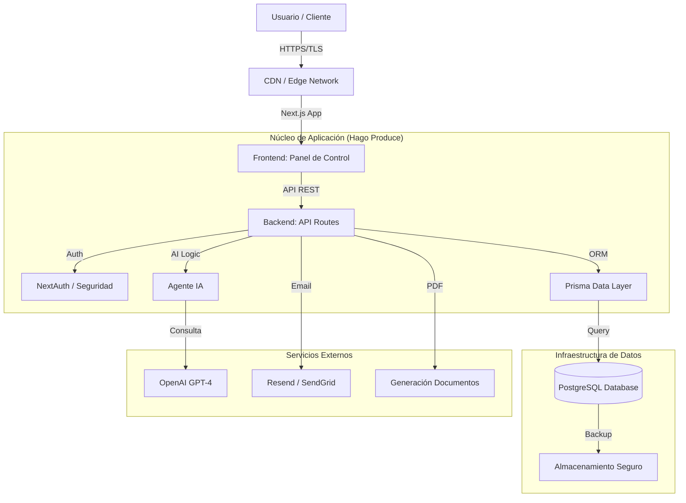
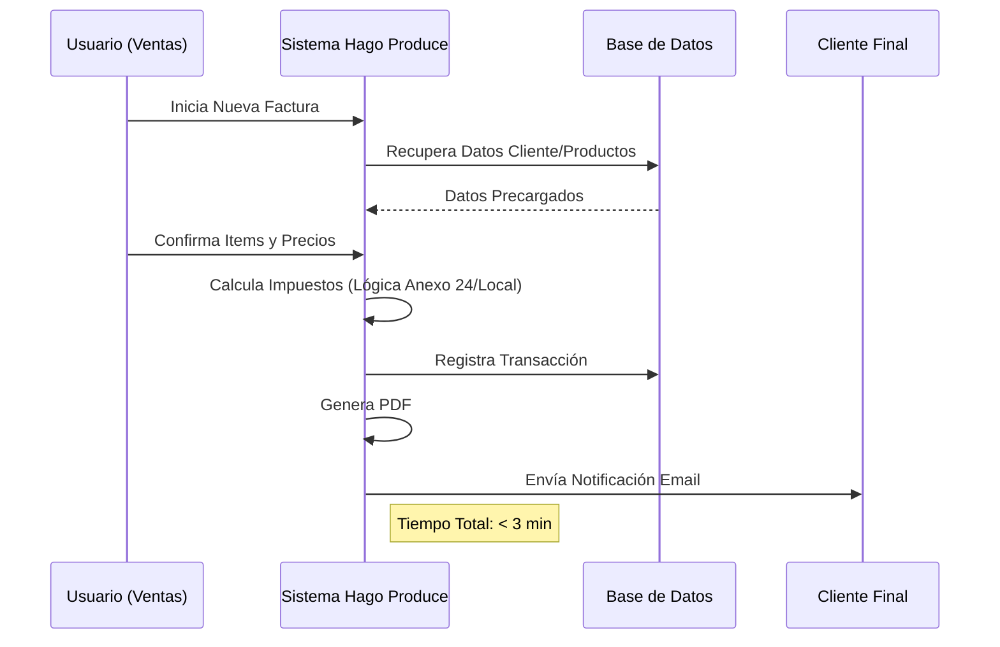

# INFORME EJECUTIVO DEL PROYECTO: HAGO PRODUCE
**Fecha:** 27 de Febrero de 2026
**Preparado para:** Dirección General y Stakeholders de Hago Produce

---

## 1. RESUMEN EJECUTIVO

### Visión General
El proyecto **HAGO PRODUCE** representa la transformación digital integral de la gestión operativa y financiera de la compañía. Se ha desarrollado una plataforma web centralizada diseñada específicamente para el mercado de materias primas en Canadá, con el objetivo estratégico de lograr independencia tecnológica, optimizar flujos de trabajo críticos e integrar inteligencia artificial para la toma de decisiones.

### Objetivos Estratégicos Alcanzados
*   **Independencia Tecnológica:** Se ha construido una infraestructura robusta capaz de reemplazar la dependencia actual de QuickBooks y Google Sheets antes de la fecha límite de abril de 2026.
*   **Eficiencia Operativa:** Reducción drástica en el tiempo de generación de facturas, pasando de un promedio estimado de 20 minutos a menos de 3 minutos por operación.
*   **Centralización de Datos:** Unificación de catálogos de productos, proveedores, clientes y facturación en una "Fuente Única de Verdad" (Single Source of Truth), eliminando inconsistencias de datos.
*   **Innovación con IA:** Implementación de un Agente Digital inteligente que democratiza el acceso a la información del negocio mediante lenguaje natural.

### Resultados Clave (Al Cierre del Sprint 6)
*   **Plataforma Operativa (MVP):** Los módulos críticos de facturación, gestión de inventario y portal de clientes están funcionales.
*   **Calidad de Software:** Se ha establecido un estándar de calidad alto con una cobertura de pruebas unitarias superior al **93%** en componentes críticos, asegurando estabilidad y mantenibilidad a largo plazo.
*   **Infraestructura Escalable:** Arquitectura moderna basada en la nube (Railway/PostgreSQL) preparada para el crecimiento del volumen de transacciones.

---

## 2. ARQUITECTURA TÉCNICA Y DIAGRAMAS

### Arquitectura del Sistema
El sistema utiliza una arquitectura moderna y desacoplada, optimizada para rendimiento y escalabilidad.

### Flujo de Proceso: Facturación Inteligente
Este diagrama ilustra cómo el sistema simplifica el proceso de facturación, una de las métricas clave de éxito.

---

## 3. ANÁLISIS FUNCIONAL Y CASOS DE USO

El sistema se estructura en 5 módulos principales que cubren la totalidad de la operación comercial.

### A. Gestión Comercial y Facturación
*   **Funcionalidad:** Creación rápida de facturas, notas de crédito y gestión de estados de pago.
*   **Caso de Uso Real:** Un agente de ventas necesita facturar un pedido urgente de 5 toneladas de fruta. El sistema precarga los datos del cliente, sugiere precios basados en el historial y calcula automáticamente los impuestos aplicables, permitiendo emitir la factura desde una tablet o PC en segundos.

### B. Agente Inteligente de Negocios
*   **Funcionalidad:** Chatbot integrado capaz de responder preguntas complejas sobre el negocio.
*   **Caso de Uso Real:** La gerencia pregunta: *"¿Cuál fue el volumen de ventas de almendras el mes pasado comparado con el anterior?"*. El agente analiza la base de datos en tiempo real y ofrece una respuesta precisa y graficada, eliminando la necesidad de generar reportes manuales en Excel.

### C. Portal de Clientes
*   **Funcionalidad:** Acceso seguro para que los clientes consulten su historial.
*   **Beneficio:** Reduce la carga administrativa de atención al cliente (llamadas/emails pidiendo copias de facturas). Los clientes autogestionan sus documentos.

### D. Gestión de Catálogos (Inventario y Directorio)
*   **Funcionalidad:** Administración centralizada de productos, proveedores y clientes.
*   **Ventaja:** Elimina la duplicidad de información y asegura que todos los departamentos operen con los mismos datos maestros.

### E. Seguridad y Auditoría
*   **Funcionalidad:** Registro detallado de acciones (Audit Logs) y control de acceso basado en roles (RBAC).
*   **Cumplimiento:** Garantiza trazabilidad total de las operaciones, crítico para auditorías contables y fiscales.

---

## 4. RESUMEN DEL NÚCLEO TECNOLÓGICO

La plataforma está construida sobre un stack tecnológico de vanguardia ("Modern Data Stack"), seleccionado por su robustez, seguridad y soporte a largo plazo.

### Tecnologías Principales
| Capa | Tecnología | Justificación Estratégica |
| :--- | :--- | :--- |
| **Frontend** | **Next.js 14 + TailwindCSS** | Velocidad de carga extrema y experiencia de usuario fluida (tipo App nativa). |
| **Backend** | **Node.js + Serverless** | Escalabilidad automática según la demanda, reduciendo costos de infraestructura. |
| **Base de Datos** | **PostgreSQL** | El estándar de oro en bases de datos relacionales; robustez y seguridad de datos garantizada. |
| **ORM** | **Prisma** | Capa de abstracción que asegura la integridad de los datos y previene errores de consulta. |
| **Inteligencia** | **OpenAI API** | Integración nativa de capacidades cognitivas para el análisis de datos. |

### Calidad y Fiabilidad (Métricas Técnicas)
Para garantizar la estabilidad del negocio, se ha implementado una estrategia de aseguramiento de calidad (QA) rigurosa:
*   **Tests Unitarios:** Verificación automática de la lógica de negocio (Cálculos de impuestos, totales, descuentos). Cobertura actual: **>93%**.
*   **Tests de Integración:** Simulación de procesos completos en entornos aislados (Docker) para asegurar que todos los módulos cooperen correctamente.
*   **CI/CD:** Pipeline de despliegue continuo que impide la publicación de código defectuoso en producción.

### Ventajas Competitivas
1.  **Propiedad Intelectual:** A diferencia de QuickBooks (SaaS alquilado), Hago Produce es un activo propio de la empresa, personalizable al 100%.
2.  **Seguridad de Datos:** La información sensible reside en bases de datos controladas, no en hojas de cálculo dispersas y vulnerables.
3.  **Escalabilidad:** Diseñado para soportar el crecimiento de la empresa sin requerir reingeniería en los próximos 5 años.

---

## 5. CONCLUSIÓN

El proyecto HAGO PRODUCE ha superado con éxito sus fases críticas de desarrollo, entregando una plataforma operativa sólida que cumple con los requisitos de negocio y técnicos. La transición desde sistemas legados (QuickBooks/Excel) es ahora viable y segura.

La inversión en calidad de código y arquitectura moderna asegura no solo la operatividad inmediata, sino una base firme para futuras expansiones, como análisis predictivo de inventarios o integración logística avanzada.

**Estado Actual:** Listo para fase de pruebas intensivas con usuarios reales y planificación del despliegue final (Go-Live).
