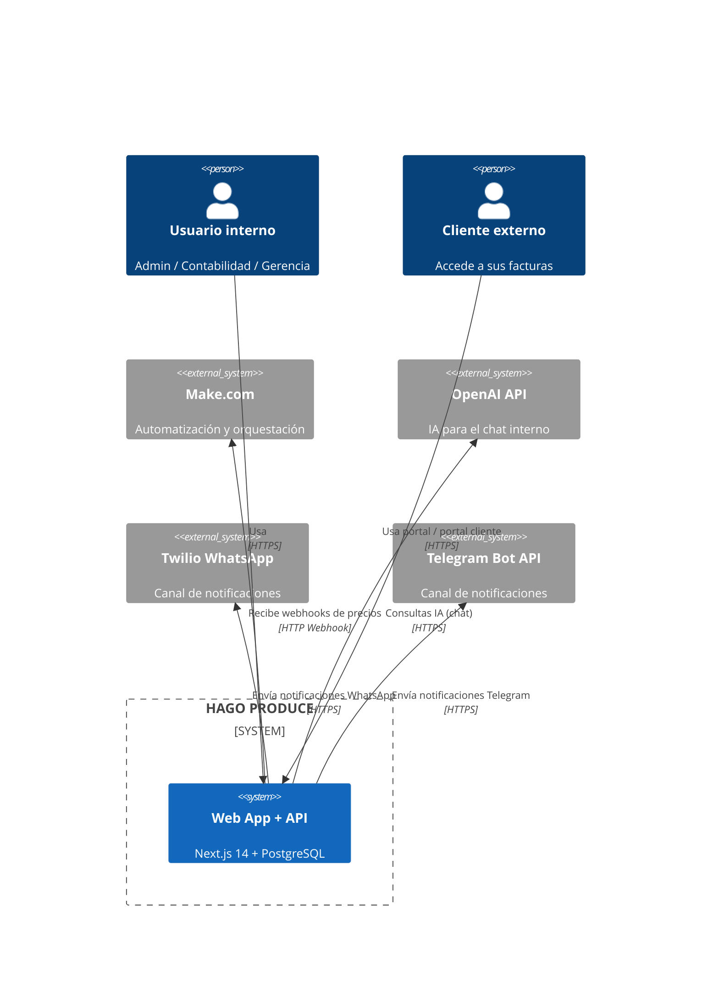
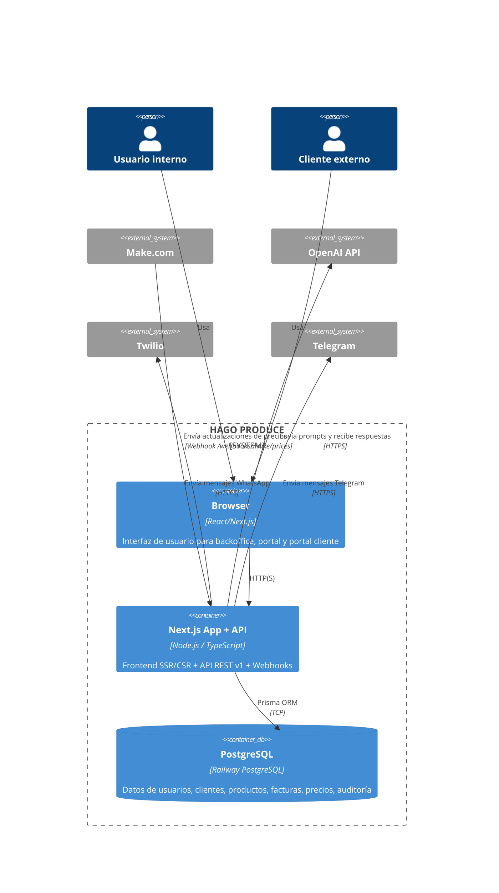
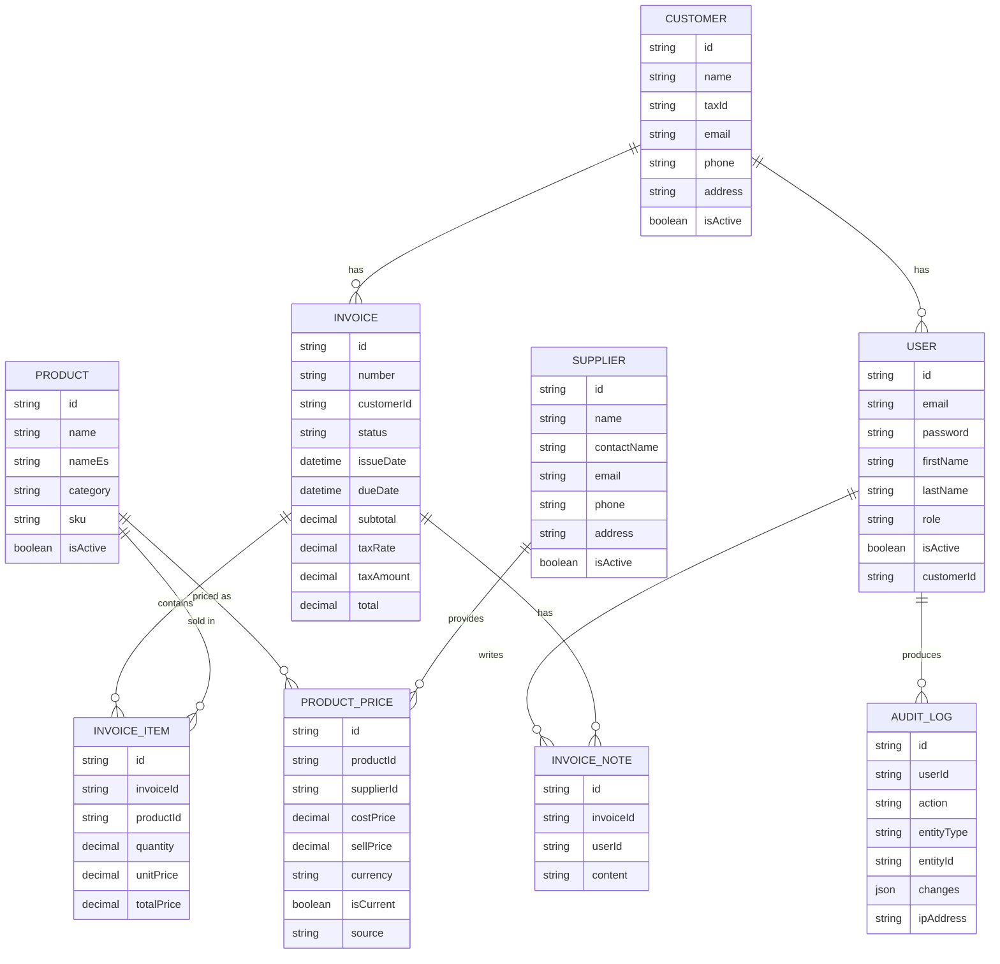

# HAGO PRODUCE — Arquitectura y estado actual del sistema

**Última actualización:** 2026-02-22  
**Ámbito:** Estado real del sistema según el código en este repositorio.

Este documento describe la **arquitectura actual**, los **módulos implementados**, las **APIs disponibles**, el **modelo de datos real** (Prisma), las **integraciones**, y los **gaps** frente al diseño original de Fase 0 / roadmap.

Su objetivo es ser la **fuente de verdad técnica actual** para:

- Entender qué hace hoy el sistema.  
- Detectar qué falta por implementar.  
- Tomar decisiones informadas para priorizar el roadmap (Fase 1B, 1C, 2, etc.).

---

## 1. Visión general de arquitectura

### 1.1. Stack tecnológico actual

Basado en `docs/tech-stack.md` y el código fuente:

- **Framework Web:** Next.js 14 (App Router, Server Components + Client Components).  
- **Lenguaje:** TypeScript.  
- **UI:** TailwindCSS + shadcn/ui.  
- **Backend:** Next.js API Routes (`src/app/api`).  
- **Base de datos:** PostgreSQL (Railway) con Prisma ORM.  
- **Auth (implementado):** JWT propio con `jsonwebtoken` (`src/lib/auth/*`).  
- **Testing:** Jest + `next/jest`, tests unitarios y de integración en `src/tests`.  
- **Infraestructura:** Railway (App + DB), GitHub Actions para CI/CD, Dockerfile + docker-compose.

> Nota: aunque en algunos documentos de stack se menciona NextAuth/Supabase Auth, **el código actual usa JWT propio**.

### 1.2. Vista de contexto (C4 — Nivel 1)



### 1.3. Vista de contenedores (C4 — Nivel 2)



### 1.4. Componentes principales (C4 — Nivel 3)

**Front-end (Next.js App Router)**

- `src/app/(auth)` — Login / Register para usuarios internos.  
- `src/app/(admin)` — Backoffice: dashboard, productos, proveedores, clientes, usuarios, facturas, chat.  
- `src/app/(customer)` — Portal clásico de cliente: `my-invoices`.  
- `src/app/(portal)` — Nuevo portal cliente con login por RFC/tax_id y dashboard dedicado.  
- Componentes UI reutilizables en `src/components/ui` (shadcn).

**Back-end (API REST v1 + Webhooks)**

- `src/app/api/v1/auth/*` — Login, register, refresh, me, customer-login.  
- `src/app/api/v1/users/*` — Gestión de usuarios internos.  
- `src/app/api/v1/customers/*` — Gestión de clientes.  
- `src/app/api/v1/suppliers/*` — Gestión de proveedores.  
- `src/app/api/v1/products/*` — Gestión de productos.  
- `src/app/api/v1/product-prices/*` — Gestión de precios por producto/proveedor (+ bulk update).  
- `src/app/api/v1/invoices/*` — Facturas y notas internas.  
- `src/app/api/v1/chat/query` — Chat de negocio (IA).  
- `src/app/api/v1/notifications` — Disparador interno de notificaciones.

**Webhooks**

- `src/app/webhooks/make/prices` — Webhook desde Make.com para importar precios.  
- `src/app/webhooks/notifications/send` — Webhook de envío de notificaciones (Twilio/Telegram), con seguridad y idempotencia.

**Servicios de dominio (capa de negocio)**

- `src/lib/services/*.service.ts` para usuarios, clientes, proveedores, productos, precios, facturas.  
- `src/lib/services/invoices/notes.ts` para notas internas.  
- `src/lib/services/chat/*` para intents, ejecución de queries y cliente OpenAI.  
- `src/lib/services/notifications/*` para envío y triggers de notificaciones.

**Autenticación / seguridad**

- `src/lib/auth/jwt.ts` — generación y verificación de JWT.  
- `src/lib/auth/middleware.ts` — extracción de usuario desde `Authorization: Bearer`.  
- `src/lib/auth/password.ts` — hash/compare con bcrypt.  
- `src/lib/hooks/useAuth.ts` — sesión de usuario interno.  
- `src/lib/hooks/useCustomerAuth.ts` — sesión de cliente (portal).

**Auditoría**

- `src/lib/audit/logger.ts` y `src/lib/audit/invoices.ts` — registro de cambios de facturas en `AuditLog`.

---

## 2. Inventario de módulos y capacidades

### 2.1. Autenticación y usuarios internos

**Estado:** Implementado.

- JWT propio con expiración (`ACCESS_TOKEN_EXPIRES_IN`, `REFRESH_TOKEN_EXPIRES_IN`).  
- Endpoints:
  - `POST /api/v1/auth/login`  
  - `POST /api/v1/auth/register`  
  - `POST /api/v1/auth/refresh`  
  - `GET  /api/v1/auth/me`  
- Roles (`@prisma/client`): `ADMIN`, `ACCOUNTING`, `MANAGEMENT`, `CUSTOMER`.  
- UI de login/registro en `src/components/auth/*` y páginas en `(auth)`.  
- Hook `useAuth` mantiene `user` y `accessToken` en `localStorage`.

### 2.2. Gestión de usuarios internos

**Estado:** Implementado.

- Servicio: `src/lib/services/users.service.ts`.  
- API:
  - `GET /api/v1/users` — solo `ADMIN`.  
  - `POST /api/v1/users` — solo `ADMIN`.  
  - `GET /api/v1/users/[id]` — `ADMIN` o el propio usuario.  
  - `PUT /api/v1/users/[id]` — el usuario puede editarse a sí mismo; solo `ADMIN` puede cambiar `role` o `isActive`.  
- Tests: `src/tests/integration/users-api.test.ts`, `src/tests/unit/users.service.test.ts`.

### 2.3. Clientes (Customers)

**Estado:** Implementado.

- Modelo `Customer` en `prisma/schema.prisma`.  
- Servicio: `src/lib/services/customers.service.ts`.  
- API:
  - `GET /api/v1/customers` — listado con filtros y paginación.  
  - `POST /api/v1/customers` — creación (roles internos).  
  - `GET /api/v1/customers/[id]` —
    - Usuarios internos: acceso normal.
    - `CUSTOMER`: solo puede acceder a su propio `Customer` (compara `user.customerId` con `params.id`).  
  - `PATCH /api/v1/customers/[id]` — solo `ADMIN`.  
- Tests: `src/tests/integration/customers-api.test.ts`.

### 2.4. Proveedores (Suppliers)

**Estado:** Implementado.

- Modelo `Supplier`.  
- Servicio: `src/lib/services/suppliers.service.ts`.  
- API:
  - `GET /api/v1/suppliers` — listado con filtros.  
  - `POST /api/v1/suppliers` — crear (roles `ADMIN`, `ACCOUNTING`).  
  - `GET /api/v1/suppliers/[id]` — ver detalle.  
  - `PUT /api/v1/suppliers/[id]` — actualizar (solo roles permitidos).  
- Validación: `src/lib/validation/suppliers.ts`.

### 2.5. Productos

**Estado:** Implementado.

- Modelo `Product` (incluye `name`, `nameEs`, `sku`, `category`, `isActive`, `deletedAt?`).  
- Servicio: `src/lib/services/productService.ts`.  
- API:
  - `GET /api/v1/products` — filtros: `search`, `category`, `isActive`, `page`, `limit`.  
  - `POST /api/v1/products` — creación.  
  - `GET /api/v1/products/[id]` — detalle.  
  - `PUT /api/v1/products/[id]` — actualización.  
- UI admin: `src/app/(admin)/products/page.tsx` + `ProductsTable`, `ProductModal`, `ProductForm`.

### 2.6. Precios por producto/proveedor (Product Prices)

**Estado:** Implementado (incluye integración Make.com).

- Modelo `ProductPrice` con `productId`, `supplierId`, `costPrice`, `sellPrice?`, `currency`, `effectiveDate`, `isCurrent`, `source`.  
- Servicio: `src/lib/services/product-prices/product-prices.service.ts`.  
  - `getAll`, `create` (gestiona `isCurrent`), `bulkUpdateFromMake`.  
- API:
  - `GET /api/v1/product-prices` — filtros `product_id`, `supplier_id`, `is_current`, paginación.  
  - `POST /api/v1/product-prices` — creación, maneja `isCurrent`.  
  - `GET /api/v1/product-prices/[id]`, `PATCH`, `DELETE`.  
  - `POST /api/v1/product-prices/bulk-update` — usado por Make.
- Webhook Make:
  - `POST /webhooks/make/prices` con header `x-api-key: MAKE_WEBHOOK_SECRET`.  
- Tests: `src/tests/unit/product-prices/product-prices.service.test.ts`, `src/tests/integration/product-prices-api.test.ts`.

### 2.7. Facturación (Invoices, Items, Notes)

**Estado:** Implementado (núcleo completado).

- Modelos:
  - `Invoice`, `InvoiceItem`, `InvoiceNote`, enum `InvoiceStatus`.  
  - `AuditLog` para auditoría de cambios en facturas.
- Servicios:
  - `src/lib/services/invoices.service.ts` — creación, listado, filtros, actualización.
  - `src/lib/services/invoices/notes.ts` — notas internas.
  - Auditoría: `src/lib/audit/invoices.ts` + `src/lib/audit/logger.ts`.
- API:
  - `GET /api/v1/invoices` —
    - Filtros por estado, cliente, rango de fechas, etc.  
    - Si el usuario tiene rol `CUSTOMER`, se fuerza `filters.customerId = user.customerId`.
  - `POST /api/v1/invoices` — creación de factura (usuarios internos).  
  - `GET /api/v1/invoices/[id]` — detalle; respeta permisos para `CUSTOMER`.  
  - `PATCH /api/v1/invoices/[id]` — actualización.  
  - `PATCH /api/v1/invoices/[id]/status` — cambio de estado.  
  - `GET/POST /api/v1/invoices/[id]/notes` — gestión de notas internas.
- UI:
  - Listado: `InvoiceList`, `InvoiceFilters`.  
  - Creación/edición: `CreateInvoiceForm`, `InvoiceItemsTable`, `ProductAutocomplete`.  
  - Detalle: `InvoiceDetail`, `StatusHistory`, `InternalNotes`, `DownloadPDFButton`, `PDFPreview`.

### 2.8. Portal de cliente (clásico y nuevo)

**Estado:** Implementado (versión inicial + portal dedicado).

- Portal clásico:
  - Ruta: `src/app/(customer)/my-invoices/page.tsx`.  
  - Usa `InvoiceList` + filtro automático por `customerId` vía API.

- Nuevo portal `(portal)`:
  - Login por `tax_id` + password:
    - `POST /api/v1/auth/customer-login` — valida `Customer` activo y usuario asociado con rol `CUSTOMER`.
  - Hook de sesión de cliente: `src/lib/hooks/useCustomerAuth.ts`.  
  - Componentes:
    - `CustomerDashboardSummary` — resumen de facturas por estado.  
    - `CustomerInvoiceDetailDialog` — detalle de factura, preview y descarga.
  - Tests:
    - `src/tests/integration/customer-portal.test.ts` verifica que `CUSTOMER` solo ve sus facturas.

### 2.9. Chat de negocio (AI Assistant interno)

**Estado:** Implementado (versión inicial basada en OpenAI).

- Endpoint principal:
  - `POST /api/v1/chat/query` — recibe mensaje del usuario + idioma, analiza intención, ejecuta queries y formatea respuesta con OpenAI.
- Servicios:
  - `analyzeIntent` — determina intención (ej. consulta de precios, facturas, proveedores).  
  - `executeQuery` — ejecuta consultas Prisma según la intención.  
  - `openai-client` — envía prompt al modelo y convierte el resultado en `displayText` + estructura de datos.
- UI:
  - Página `/chat` en `src/app/(admin)/chat/page.tsx`.  
  - `ChatInterface`, `ChatInput`, `ChatMessage` en `src/components/chat/`.

### 2.10. Sistema de notificaciones externas

**Estado:** Implementado (WhatsApp/Telegram vía webhook + capa interna).

- Webhook externo:
  - `POST /webhooks/notifications/send` — llamada desde Make u otros sistemas.
  - Seguridad: `x-api-key: NOTIFICATIONS_WEBHOOK_SECRET` + rate limiting + idempotencia (`Idempotency-Key`).  
  - Puede enviar a `whatsapp`, `telegram` o `both`.  
- Endpoint interno:
  - `POST /api/v1/notifications` — solo `ADMIN` y `ACCOUNTING` pueden disparar triggers.  
  - Tipos soportados: `status_change`, `due_date`, `overdue`.
- Servicios:
  - `notifications/service.ts` — orquesta envío al webhook (`NOTIFICATIONS_WEBHOOK_URL`).  
  - `notifications/twilio.ts` — integración con Twilio WhatsApp.  
  - `notifications/telegram.ts` — integración con Telegram Bot.  
  - `notifications/triggers.ts` — lógica para cambios de estado de factura y vencimientos.
- Tests:
  - `src/tests/integration/notifications-webhook.test.ts`.  
  - `src/tests/unit/notifications/*`.

---

## 3. Modelo de datos (Prisma)

El modelo completo está definido en `prisma/schema.prisma`. A nivel conceptual:

- **User** — usuarios internos y de portal.  
- **Customer** — clientes externos.  
- **Supplier** — proveedores.  
- **Product** — productos.  
- **ProductPrice** — precios producto–proveedor.  
- **Invoice / InvoiceItem / InvoiceNote** — facturas, renglones y notas.  
- **AuditLog** — auditoría de acciones.

### 3.1. Diagrama entidad-relación (simplificado)



---

## 4. APIs y contratos (resumen con ejemplos)

Aquí se resumen los contratos principales; para detalle exhaustivo se puede complementar con los documentos de Fase 0 (`DocumentacionHagoProduce/docs/03_api_contracts.md`).

### 4.1. Convenciones generales

- **Autenticación:** `Authorization: Bearer <token>`.  
- **Formato de éxito:**

```json
{
  "success": true,
  "data": { },
  "meta": { }
}
```

- **Formato de error:**

```json
{
  "success": false,
  "error": {
    "code": "ERROR_CODE",
    "message": "Mensaje en español",
    "details": {}
  }
}
```

### 4.2. Ejemplos clave

**Login usuario interno** — `POST /api/v1/auth/login`

```json
{
  "email": "admin@example.com",
  "password": "MiPassword123"
}
```

Respuesta 200:

```json
{
  "success": true,
  "data": {
    "user": {
      "id": "uuid",
      "email": "admin@example.com",
      "firstName": "Admin",
      "lastName": "User",
      "role": "ADMIN"
    },
    "tokens": {
      "accessToken": "jwt...",
      "refreshToken": "jwt..."
    }
  }
}
```

**Login cliente portal** — `POST /api/v1/auth/customer-login`

```json
{
  "tax_id": "RFC123456789",
  "password": "MiPassword123"
}
```

Respuesta 200:

```json
{
  "success": true,
  "data": {
    "customer": {
      "id": "cust-123",
      "companyName": "Supermercado Del Valle",
      "taxId": "RFC123456789"
    },
    "accessToken": "jwt..."
  }
}
```

**Consulta de facturas** — `GET /api/v1/invoices`

```http
GET /api/v1/invoices?page=1&limit=10&status=PAID&startDate=2026-02-01&endDate=2026-02-29
Authorization: Bearer <token>
```

Si el usuario es `CUSTOMER`, el backend añade automáticamente `customerId = user.customerId` al filtro.

**Chat de negocio** — `POST /api/v1/chat/query`

```json
{
  "language": "es",
  "message": "¿Precio actual de la Manzana Gala?"
}
```

Respuesta 200 (ejemplo simplificado):

```json
{
  "success": true,
  "data": {
    "language": "es",
    "displayText": "El precio actual de Manzana Gala es $1.20 USD/kg con Fresh Farms.",
    "items": []
  }
}
```

**Webhook notificaciones** — `POST /webhooks/notifications/send`

```json
{
  "channel": "whatsapp",
  "text": "Factura #123 está próxima a vencer.",
  "toWhatsApp": "whatsapp:+5215555550000"
}
```

Headers:

```http
x-api-key: <NOTIFICATIONS_WEBHOOK_SECRET>
Idempotency-Key: notif-123
```

---

## 5. Especificaciones no funcionales

### 5.1. Seguridad

- JWT con expiración (1h access, 7d refresh).  
- Contraseñas hasheadas con bcrypt.  
- Roles y RBAC en endpoints (Auth middleware + checks por rol).  
- Webhooks protegidos por API Key + rate limiting + idempotencia.  
- Auditoría para operaciones críticas sobre facturas (`AuditLog`).

### 5.2. Rendimiento y métricas

- Requisitos objetivo (de Fase 0):
  - API p95 < 200ms.  
  - Carga de página < 2s.  
  - Creación de factura < 3s.
- Estado actual:
  - No hay telemetría técnica integrada (Sentry, Prometheus, etc.).  
  - Solo logs en consola + auditoría funcional.  
  - **Gap:** incorporar métricas reales para validar estos objetivos.

### 5.3. Escalabilidad

- Arquitectura monolito Next.js + PostgreSQL, adecuada para el tamaño actual.  
- Módulos de chat y notificaciones se han diseñado desacoplados, preparando una futura extracción a servicios dedicados si la carga crece.

---

## 6. Capacidades actuales vs gaps

### 6.1. Capacidades actuales

- Auth JWT y gestión de usuarios internos.  
- Catálogo de clientes, proveedores, productos y precios por proveedor.  
- Facturación con items, notas internas, auditoría y controles de estado.  
- Portal de cliente (clásico) y portal dedicado `(portal)` con login por RFC/tax_id.  
- Chat interno de negocio integrado con OpenAI (texto + estructura).  
- Sistema de notificaciones hacia WhatsApp/Telegram via Webhook + triggers.

### 6.2. Gaps técnicos y funcionales

- Reportes avanzados (dashboard analítico) aún no implementados (solo wireframes).  
- Sin tabla dedicada para histórico de estados de factura (se usa `AuditLog`).  
- Sin métricas técnicas ni observabilidad estructurada.  
- Configuración avanzada de notificaciones por cliente/canal no implementada.  
- Multi-moneda avanzada (tipos de cambio, preferencias por cliente) pendiente.

---

## 7. Versionado de documentación y mantenimiento

- Este documento describe el **estado actual** de `main`.  
- Cada cambio relevante en APIs, modelo de datos o módulos debe venir acompañado de una actualización aquí.  
- Recomendación:
  - Mantener un campo `Versión de documento` y actualizar la fecha en el encabezado.  
  - Revisar este documento al cerrar cada fase del roadmap (1B, 1C, 2...).

